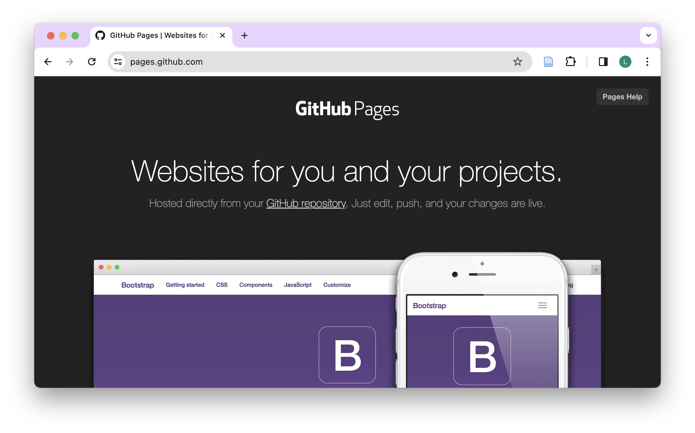

```{r}
#| echo: false
library(knitr)
library(tidyverse)
library(countdown)
```

# Welcome! {background-color="#4C326A"}

## Meet the lecturer {.smaller}

**Lars Schöbitz**

{fig-alt="Headshot of Lars Schöbitz" fig-align="left" width="50%"}

-   Environmental Engineer `r emo::ji("hammer")`
-   Retired researcher `r emo::ji("bed")`
-   [RStudio certified instructor](https://education.rstudio.com/trainers/)
-   [Data steward at ETHZ](https://ghe.ethz.ch/ghe-blog-news/2024/02/blog-attention-prof-you-need-a-data-steward-for-your-team.html)

## Learning objectives

By the end of this workshop, participants will be able to:

::: incremental
1.  [Create]{.highlight-yellow} and [clone]{.highlight-yellow} repositories, and explain the difference between cloning and forking a repository.

2.  Apply the standard Git workflow using RStudio IDE—including [pull, stage, commit, and push]{.highlight-yellow} changes to GitHub.

3.  Work with [branches]{.highlight-yellow} and [pull requests]{.highlight-yellow} by creating and managing development branches (using both RStudio and the terminal), submitting [pull requests]{.highlight-yellow}, and [reviewing and commenting]{.highlight-yellow} on others’ pull requests to facilitate code review and collaborative development.
:::

## Teaching strategy

-   Teaching Git on a "need to know" basis
-   Teaching only a very small subset of Git's functionality
-   Creating a safe space for learning and getting support (use Element)
-   Focus on collaboration aspects of GitHub

## Schedule

```{r}
#| tbl-colwidths: [25,75]
#| echo: false

read_csv(here::here("data/tbl-01-gitforsci-cis-course-schedule.csv")) |> 
  filter(day == 1) |> 
  select(Time = time, Module = title) |> 
  kable()
  
```

## Your turn

:::: task
Think about the last time you published a written document:

-   Which tasks gave you joy?
-   Which tasks were challenging or frustrating?

::: hand
Take some written notes.
:::
::::

```{r}
#| echo: false

countdown(minutes = 2)
```

# GitHub for Collaboration {background-color="#4C326A"}

##  {background-image="images/github_friends.png"}

::: footer
Illustrations from the [Openscapes](https://openscapes.org/) blog GitHub for supporting, contributing, and failing safely by Allison Horst and Julia Lowndes
:::

::: {.notes}
Why GitHub?

“Collaboration is the most compelling reason to manage a project with Git and GitHub. My definition of collaboration includes hands-on participation by multiple people, including your past and future self, as well as an asymmetric model, in which some people are active makers and others only read or review.” - Jenny Bryan

Bryan J. 2017. Excuse me, do you have a moment to talk about version control? PeerJ Preprints 5:e3159v2 https://doi.org/10.7287/peerj.preprints.3159v2
:::

##  {background-image="images/github_wickham_bryan_git_quote.png"}

::: footer
Illustrations from the [Openscapes](https://openscapes.org/) blog GitHub for supporting, contributing, and failing safely by Allison Horst and Julia Lowndes
:::

::: {.notes}
Why GitHub?

The concepts, mechanics, and vocabulary of GitHub (and underlying software Git) are new and unfamiliar when we get started or learn more about its capabilities. 

Hadley Wickham and Jenny Bryan use the **analogy of climbing** to describe how GitHub can keep us **safe while also showing our journey**.

Wickham & Bryan, R Packages https://r-pkgs.org/preface.html
:::

##  {background-image="images/github_compare_text.png"}

::: footer
Illustrations from the [Openscapes](https://openscapes.org/) blog GitHub for supporting, contributing, and failing safely by Allison Horst and Julia Lowndes
:::

::: {.notes}
GitHub helps streamline our work

GitHub helps streamline our work because it takes care of otherwise **time-consuming bookkeeping** and **unrelenting file tracking**. 

Instead of spending our time inspecting and fretting over whether “analysis_final_v2.xls” or “analysis_final_final.xls” is **truly the final version**, with GitHub we can **be confident in our completed analysis** and move to the next step.
:::

##  {background-image="images/github_groundcrew_text.png"}

::: footer
Illustrations from the [Openscapes](https://openscapes.org/) blog GitHub for supporting, contributing, and failing safely by Allison Horst and Julia Lowndes
:::

::: {.notes}
GitHub helps us support others and existing work. 

Whether we are organizing, improving documentation, or asking and answering questions, GitHub helps us provide **support to our collaborators on projects**, whether we are writing code or not.
:::

##  {background-image="images/github_reuse.jpg"}

::: footer
Illustrations from the [Openscapes](https://openscapes.org/) blog GitHub for supporting, contributing, and failing safely by Allison Horst and Julia Lowndes
:::

::: {.notes}
GitHub helps us reuse existing work

GitHub helps us reuse existing work, which lets us **learn and build from other people’s shared experience** rather than reinventing on our own. 

Plus, the **existing work gets better each time someone tries it and shares their experience back**. Whether it’s code, documentation, or knowledge through posted conversations, reusing existing things can save time, resources, and frustration. Importantly, **reuse also expands the value of existing work while celebrating the contributions of others.**
:::

##  {background-image="images/github_clip.png"}

::: footer
Illustrations from the [Openscapes](https://openscapes.org/) blog GitHub for supporting, contributing, and failing safely by Allison Horst and Julia Lowndes
:::

::: {.notes}
GitHub helps us contribute

GitHub helps us contribute **ideas through code, text, and more**, with less worry about file management. This helps us feel more confident to share **work-in-progress** and contribute to existing work, **knowing that we won’t break things**. 

It also helps us share work earlier that might be imperfect, since we can still make changes from there.
:::

##  {background-image="images/github_fall.png"}

::: footer
Illustrations from the [Openscapes](https://openscapes.org/) blog GitHub for supporting, contributing, and failing safely by Allison Horst and Julia Lowndes
:::

::: {.notes}
GitHub helps us fail safely

GitHub helps us fail safely. Because we can **return to previous versions easily**, painful consequences of failing are reduced. We can more bravely try things and start making contributions, knowing that some (many?) will fail - but won’t be catastrophic! 

When we fail, we’ll be able to **start again from where we left off** (instead of from the ground), and **a clear history** can help us **learn from the past**.
:::

##  {background-image="images/github_scoping.jpeg"}

::: footer
Illustrations from the [Openscapes](https://openscapes.org/) blog GitHub for supporting, contributing, and failing safely by Allison Horst and Julia Lowndes
:::

::: {.notes}
Harness the power of GitHub.

Once we are **empowered to work collaboratively with GitHub**, it opens up a whole **new world of projects** that feel more welcoming because we can contribute in many different ways, using familiar approaches, and evolving with new possibilities as they emerge. 

This transferrable ability to collaborate and develop confidence for trying new things might just be the best thing about GitHub.
:::

##  {background-image="images/github_harness.jpeg"}

::: footer
Illustrations from the [Openscapes](https://openscapes.org/) blog GitHub for supporting, contributing, and failing safely by Allison Horst and Julia Lowndes
:::

::: {.notes}
GitHub for the win!

GitHub enables new frontiers for open science as we **collaborate, share, and publish more easily**. 

And, it is critical to continually question who is safe to participate with these tools. **Who is not yet participating, and why?** Barriers to access include **past exclusion, skills, and support**. Let’s all work empathetically and inclusively to **help make more people feel welcome and safe** using these powerful tools so we can all go further, together.
:::

## Read on: GitHub strategies

1.  Openscapes Champions Lesson Series. @julia_stewart_lowndes_2024_14428503: <https://openscapes.github.io/series/core-lessons/github/>

2.  Excuse Me, Do You Have a Moment to Talk About Version Control? <https://peerj.com/preprints/3159/>

# Create & Clone {background-color="#4C326A"}

## Your turn

:::: task
-   Open github.com
-   Navigate to your profile
-   When completed, place a yellow sticky note on your laptop

::: hand
Now, follow along the screen and instructor.
:::
::::

```{r}
#| echo: false

countdown(minutes = 1)
```

## Your turn {.smaller}

:::: task
1.  Clone a GitHub repository of a fellow student (browse: github.com/username to fine the repository `website`)
2.  Open the repository in RStudio IDE
3.  Make a change the `README.md` file
4.  Save the file
5.  Stage, Commit & Push the changes

| id  | username1       | username2         |
|-----|-----------------|-------------------|
| 1   | Madliboom       | fdaguanno         |
| 2   | TillRoost       | mag-wer           |
| 3   | pacotvj99       | louma3000         |
| 4   | ellahenninger   | CamilleFournierDL |
| 5   | dheimgartner    | jineichen         |
| 6   | vgeier          | rjalcock          |
| 7   | Jonathan-Elkobi | rainbow-train     |

::: hand
What happens?
:::
::::

```{r}
#| echo: false

countdown(minutes = 5)
```

## Read on: Fork and clone

-   [Happy Git and GitHub for the useR](https://happygitwithr.com/fork-and-clone)

## Take a break

[Please get up and move!]{.highlight-yellow} Leave your emails alone.

{width="50%" fig-alt="This is the prompt generated by DALL-E 3 by OpenAI: A pixel art scene representing the concept of taking a break. The scene shows a serene outdoor setting with a clear blue sky. In the center, a small pixelated character is sitting comfortably on a bright green grassy hill, under the shade of a large, leafy tree. The character is depicted in a relaxed pose, perhaps sipping a warm beverage from a small cup. Nearby, a gentle stream flows, and a few fluffy white clouds drift in the sky. The overall mood of the image is peaceful and calming, emphasizing the tranquility of taking a break in nature."}

```{r}
#| echo: false
countdown(minutes = 15)
```

::: footer
Image generated with [DALL-E 3 by OpenAI](https://openai.com/blog/dall-e/)
:::

# Clone & Branch {background-color="#4C326A"}

## Your turn {.smaller}

:::: task
1.  Open the landing page for the GitHub organization 'gitforsci-cis': <https://github.com/gitforsci-cis> (try to use your bookmark)

2.  Navigate down the page to the section "Repositories" and use the search field to find the repository called `man-washinvestments-USERNAME` where USERNAME is your GitHub username.

3.  Click on the repository name to open it.

4.  Click on the green "Code" button.

5.  Copy the HTTPS URL to your clipboard by clicking on the clipboard sign.

6.  Open the RStudio IDE on your laptop.

7.  Click on [File \> New Project]{.highlight-yellow} in the top menu bar

8.  Click on Version Control.

9.  Click on Git.

10. Click on [Browse...]{.highlight-yellow} button.

11. Use the folder structure you created in the pre-course work (e.g. `~/Documents/gitrepos/gh-org-gitforsci-cis`)

12. Paste the HTTPS URL from GitHub into the "Repository URL" field.

13. Click on the "Create Project" button.

14. Find the Files tab in the bottom right pane of RStudio.

::: hand
Place the yellow sticky note on your laptop when you have completed the task.
:::
::::

```{r}
#| echo: false

countdown(minutes = 5)
```

# Pull Request & Merge {background-color="#4C326A"}

## Our turn {.smaller}

::: task
-   We will continue together with `man-washinvestments-USERNAME` where USERNAME is your GitHub
:::

```{r}
#| echo: false

countdown(minutes = 1)
```

# Publish {background-color="#4C326A"}

## Our turn {.smaller}

::: task
-   We will continue together with `man-washinvestments-USERNAME` where USERNAME is your GitHub
:::

```{r}
#| echo: false

countdown(minutes = 1)
```

## GitHub Pages

-   [GitHub Pages](https://pages.github.com/) is a free service for hosting static websites. It is ideal for blogs, course or project websites, books, presentations, and personal hobby sites.

```{r}
#| echo: false

```

## Minimal Example - Requirements

-   Landing site needs to be stored as `index.qmd`
-   The `index.qmd` needs to be stored in `docs` folder
-   Example works well for a report/article as a stand-alone page
-   Quarto provides a framework and examples for more complex websites: <https://quarto.org/docs/websites/>

## Quarto websites

-   Websites are essentially `format: html` + a Quarto Project
-   But a website is different than `format: html` in that it has multiple pages
-   Websites can be your first exploration into Quarto Projects
-   Websites and books are very similar in that they associate multiple pages/resources into a connected resource

## Learn more

::: learn-more
[quarto.org/docs/websites](https://quarto.org/docs/websites/)

```{=html}
<iframe src="https://quarto.org/docs/websites" width="100%" height="500" style="border:2px solid #123233;" title="Quarto Journal Articles"></iframe>
```
:::

# Wrap-up {background-color="#4C326A"}

## Wrap-up

-   Post your collected questions in the Element channel
-   Start your first project using Git & GitHub (already have a project? [Read here](https://happygitwithr.com/existing-github-first#existing-github-first))
-   Keep learning by doing (create PRs to yourself)
-   Share your knowledge with others (help them get started)

## Thanks!

Slides created via revealjs and Quarto: <https://quarto.org/docs/presentations/revealjs/>

Access slides as [PDF on GitHub](https://github.com/gitforsci-cis/website/raw/main/1-1-website/1-1-website.pdf)

All material is licensed under [Creative Commons Attribution Share Alike 4.0 International](https://creativecommons.org/licenses/by-sa/4.0/).

## References
