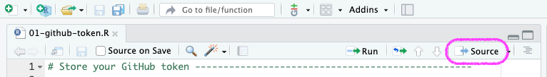
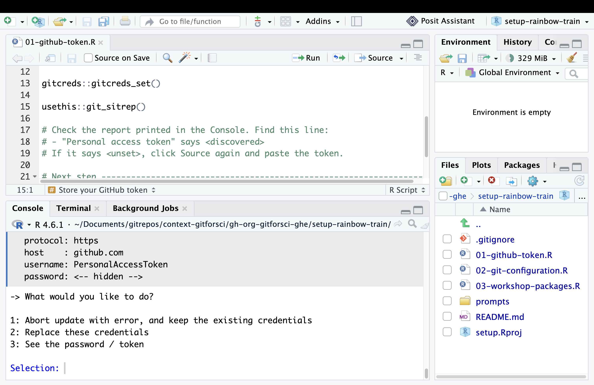
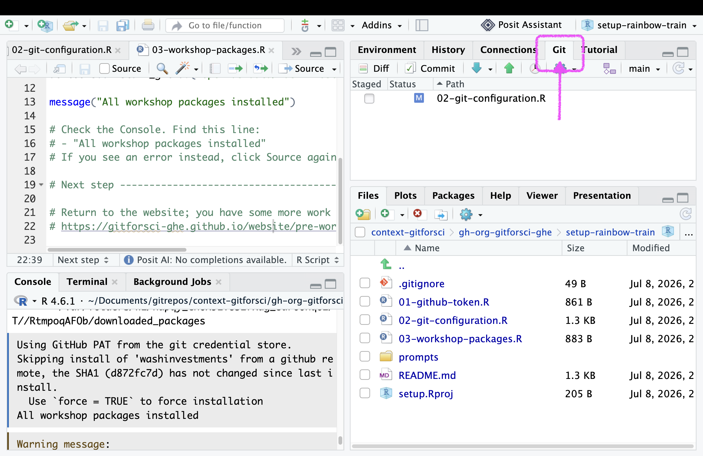
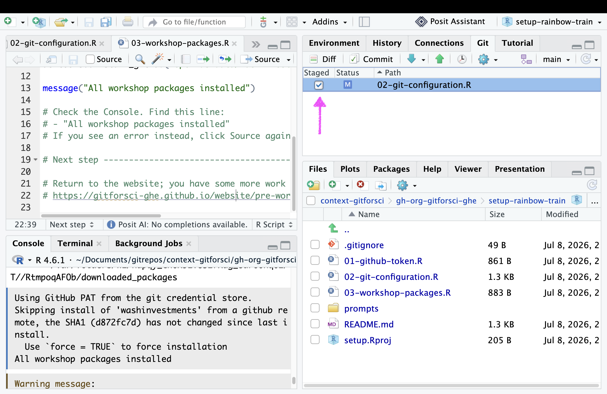
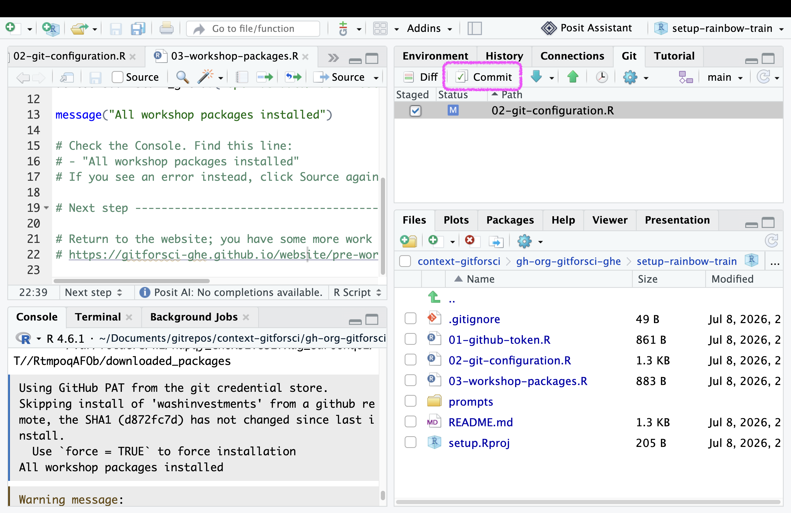
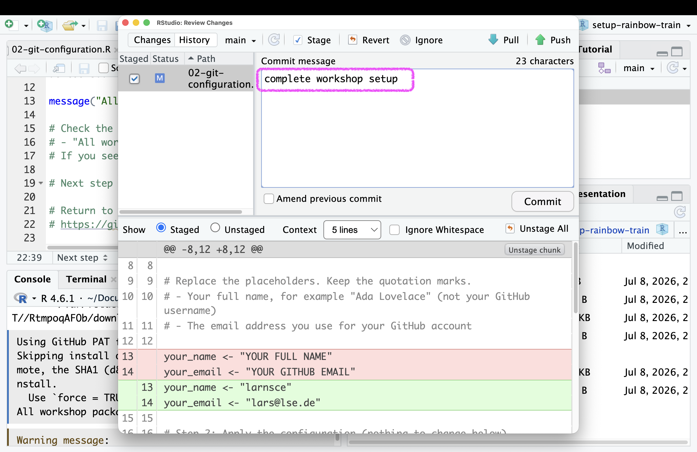
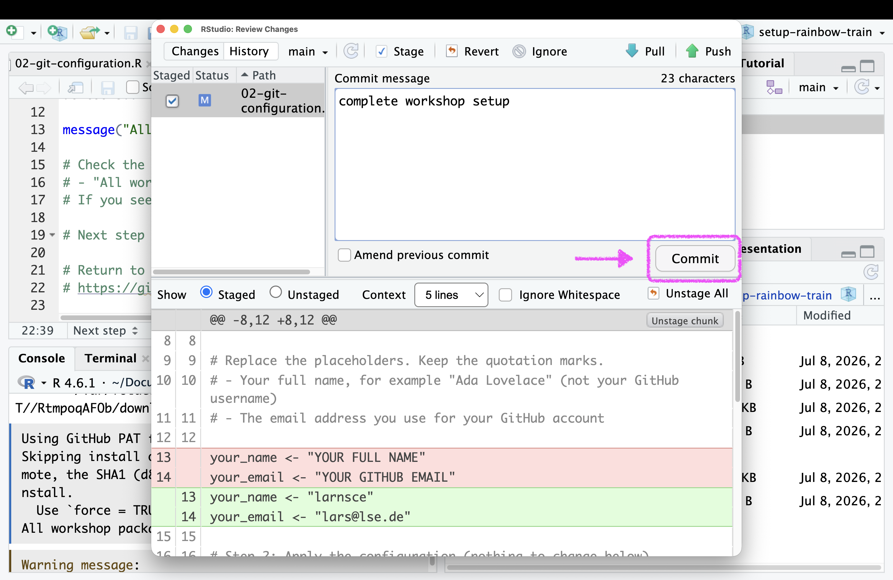
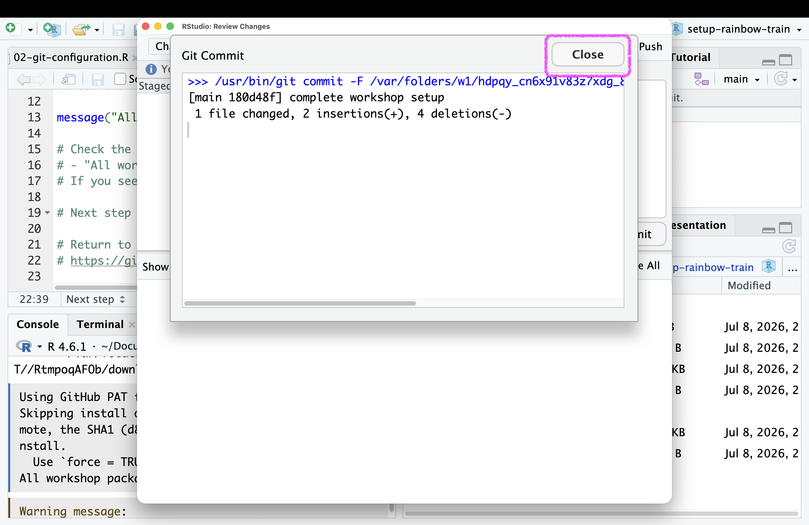
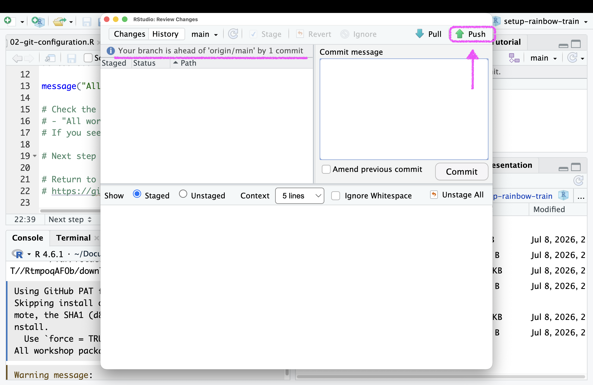
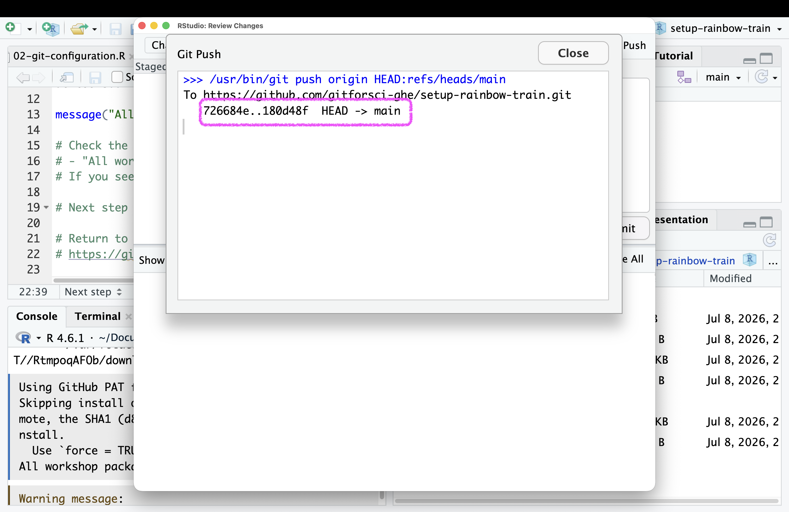

This is the second of three short steps. Your setup repository is now open in RStudio (from [Step 6a](06a-clone-repo.qmd)). Here you store your GitHub token, introduce yourself to Git, and push your first change to GitHub.

The repository contains three numbered R scripts. You run them in order by opening a script and clicking the **Source** button in the top-right corner of the script window. This step covers `01-github-token.R` and `02-git-configuration.R`; the next step covers `03-workshop-packages.R`.

## Step 1: Store your GitHub token

1. In the Files tab (bottom-right pane), click on `01-github-token.R` to open it in the editor.

2. Have the [GitHub Personal Access Token (PAT)]{.highlight-yellow} ready that you created in [Step 4 of the pre-course work](04-github-pat.qmd). If you no longer have it, create a new token on GitHub first.

3. Click the **Source** button in the top-right corner of the script window.

{width=100%}

4. When the Console asks for the token, paste it and press Enter.

::: {.callout-note}
# You may have stored a token already

If you already stored a token on this laptop earlier, the Console does not ask you to paste a new one. Instead it shows a numbered menu, as in the screenshot below. Updating the token is up to you: choose "Replace these credentials" to store a new one, or "Abort update" to keep the existing token.
:::

{width=100%}

::: {.callout-important}
# Paste the token into the Console, never into the file

Do not type or paste your token into the script file. Paste it only into the Console when asked. This keeps your token out of the repository.
:::

## Step 2: Introduce yourself to Git

1. In the Files tab, click on `02-git-configuration.R` to open it in the editor.

2. In Step 1 of the script, replace the two placeholders. Keep the quotation marks.
   - `your_name` is your full name, for example `"Ada Lovelace"` (not your GitHub username)
   - `your_email` is the email address you use for your GitHub account

3. Click the **Source** button in the top-right corner of the script window. It runs the whole script.

## Step 3: Commit and push your changes

1. Navigate to the Git pane in the top-right window of RStudio.

{width=100%}

2. Check the box next to `02-git-configuration.R` to **stage** it for **commit**.

{width=100%}

3. Click on the "Commit" button.

{width=100%}

::: callout-note

A new window will open. In the top left corner, you will see the files that you have staged for commit. In the bottom windows, you can see the changes you made in the file. The top right corner shows the "Commit message" which cannot be blank. Each Commit requires a Commit message.

:::

4. Enter a commit message in the "Commit message" field. For example: "complete git configuration"

{width=100%}

5. Click on the "Commit" button.

{width=100%}

6. Close the window that pops up.

{width=100%}

7. Click on the "Push" button.

::: callout-note
Above the top left window, you will now see the sentence "Your branch is ahead of 'origin/main' by 1 commit". This means that you have made changes to your local repository that are not yet pushed to GitHub. It also means that your Commit was successful.
:::

{width=100%}

8. Does the pop window say `HEAD -> main` as the final statement? Close it. [If not, copy what it says and email it to me now.]{.highlight-yellow}

{width=100%}

9. Verify that the changes have been pushed to GitHub by refreshing the page for your repository `01-setup-USERNAME` in your browser (for example, `01-setup-rainbow-train`). You should see the commit message you just wrote next to `02-git-configuration.R`.

TODO: screenshot of the GitHub repository page after push (to be added).

## Next step

You have configured Git and pushed your first change. Continue with [Step 6c: Install the workshop packages and report done](06c-install-verify.qmd).
