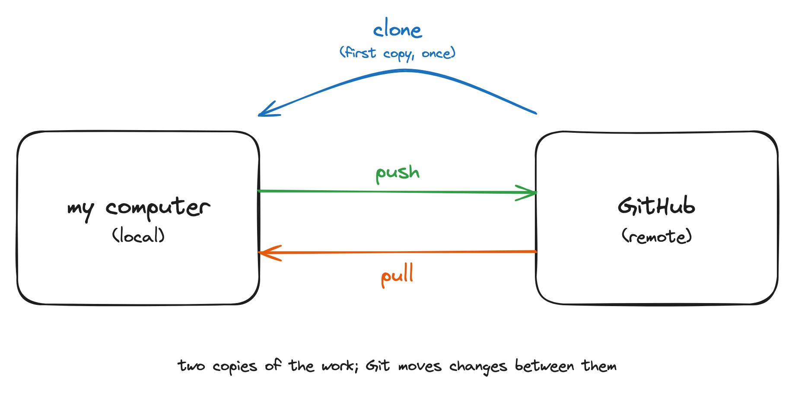
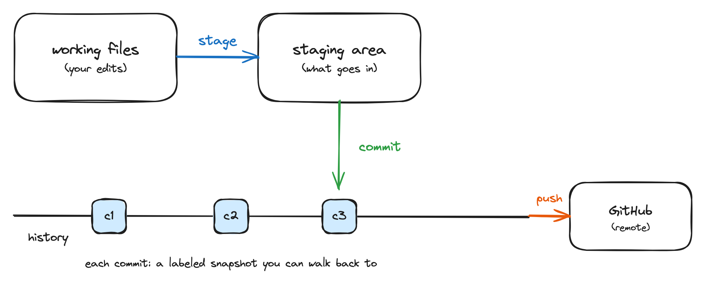
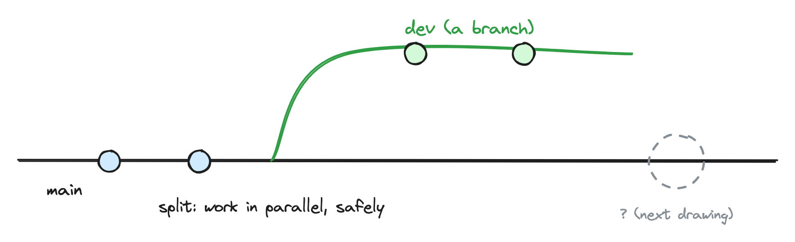
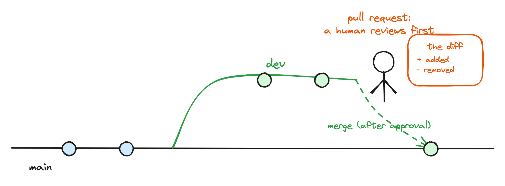

```{r}
#| echo: false
library(knitr)
library(tidyverse)
library(countdown)
library(ggthemes)
```

# Welcome!  {background-color="#0F4C81"}

## Meet the lecturer {.smaller}

****

{fig-alt="Headshot of Lars Schöbitz" fig-align="left" width="50%"}

-   Environmental Engineer 
-   Retired researcher 
-   [RStudio certified instructor](https://education.rstudio.com/trainers/)
-   [Data steward at ETHZ](https://ghe.ethz.ch/ghe-blog-news/2024/02/blog-attention-prof-you-need-a-data-steward-for-your-team.html)

## Your turn

::: task
Think about the last time you published a written document:

-   Which tasks gave you joy?
-   Which tasks were challenging or frustrating?

::: hand
Take some written notes.
:::
:::

```{r}
#| echo: false

countdown(minutes = 2)
```

## What this day is, and is not

::: incremental
-   Today [is]{.highlight-yellow} the Git and GitHub foundation for collaboration: create, clone, commit, push, branch, pull request, review, merge.
-   Today is [not]{.highlight-yellow} an AI workshop. Working with AI coding agents builds on exactly these skills; that is the follow-up workshop.
-   It is [safe to fail]{.highlight-yellow} here. Everything we do today is reversible, and breaking things is part of the plan.
:::

::: {.notes}
Defuse the AI-agent expectation gap now, in minute 5, not in minute 90. Say the safe-to-fail promise out loud; it comes back in B3 with the revert demo.
:::


##  {.center-align auto-animate="true"}

::: {style="margin-top: 50px; font-size: 1.3em"}
-   **Git** and **GitHub** -> what we learn today
-   **Quarto** and **R** -> you will see them, not learn them
-   **RStudio IDE** -> our interface, could also be VS Code, Positron IDE, GitHub Desktop, and others
:::

## Meeting you where you are {.smaller}

```{r}
#| echo: false
#| fig-cap: "Self-reported experience across the cohort (pre-course survey, n = 20)."
#| fig-width: 9
#| fig-height: 5.5

survey <- read_csv(here::here("data/private/participants-raw.csv"),
                   show_col_types = FALSE)

exp_levels_prog <- c(
  "I have none."                                                              = "None",
  "I have written a few lines now and again."                                 = "A few lines",
  "I have written programs for my own use that are a couple of pages long."   = "Own programs",
  "I have written and maintained larger pieces of software."                  = "Larger software"
)

exp_levels_git <- c(
  "I have never used Git."                                                                      = "Never",
  "I have used Git occasionally for basic tasks (e.g., cloning a repository, making commits)."  = "Occasionally",
  "I have used Git regularly for my own projects, including branching and resolving conflicts." = "Regularly",
  "I have used Git extensively for collaborative development, including advanced workflows (e.g., pull requests, rebasing, resolving complex merge conflicts)." = "Extensively"
)

# each experience column is ordered novice -> expert; rank captures that
# order so one shared colour scale reads the same across all three domains
prog_long <- survey |>
  select(
    `Programming (general)` = experience_programming_general,
    `Programming (R)`       = experience_programming_r
  ) |>
  pivot_longer(everything(), names_to = "domain", values_to = "raw") |>
  mutate(
    label = recode(raw, !!!exp_levels_prog),
    rank  = match(label, unname(exp_levels_prog))
  )

git_long <- survey |>
  select(`Git` = experience_git) |>
  pivot_longer(everything(), names_to = "domain", values_to = "raw") |>
  mutate(
    label = recode(raw, !!!exp_levels_git),
    rank  = match(label, unname(exp_levels_git))
  )

exp_counts <- bind_rows(git_long, prog_long) |>
  mutate(domain = factor(domain,
                         levels = c("Git", "Programming (general)", "Programming (R)"))) |>
  count(domain, rank, label, name = "n")

ggplot(exp_counts, aes(x = domain, y = n, fill = factor(rank),
                       group = rank)) +
  geom_col(position = position_stack(reverse = TRUE)) +
  geom_text(aes(label = ifelse(n > 0, paste0(label, " (", n, ")"), "")),
            position = position_stack(vjust = 0.5, reverse = TRUE),
            size = 3.2, colour = "white") +
  facet_wrap(~ domain, ncol = 1, scales = "free_y", strip.position = "left") +
  scale_fill_viridis_d(
    name   = NULL,
    option = "cividis",
    labels = c("least experienced", "", "", "most experienced")
  ) +
  coord_flip() +
  labs(x = NULL, y = "Participants") +
  theme_minimal(base_size = 15) +
  theme(
    axis.text.y  = element_blank(),
    axis.ticks.y = element_blank(),
    strip.placement = "outside",
    strip.text.y.left = element_text(angle = 0, hjust = 1, face = "bold"),
    legend.position = "bottom",
    panel.grid.major.y = element_blank()
  )
```

## What you want to learn {.smaller}

From your pre-course survey (n = 20), three groups:

::: incremental
-   [Covered directly today]{.highlight-yellow}: use Git without fear, the full commit cycle, branching, and collaborating and reviewing through pull requests.
-   [Partially covered]{.highlight-yellow}: resolving merge conflicts, rebasing, staging in a systematic way. We build the foundation; the advanced moves are a natural next step.
-   [The follow-up workshop]{.highlight-yellow}: Git together with AI coding agents. Roughly half of you asked for this. Today is the Git foundation that makes it possible.
:::

::: {.notes}
Counts are editorial; refresh them if the roster changes. The three buckets map onto the three personas in learner-persona.md: Arti wants to stop being afraid of Git, Bianca wants confident collaboration and pull-request review, Cem wants control and provenance of AI-assisted work. Roughly half the cohort asked for agentic-coding topics; name that and tie it back to the "not an AI workshop today" framing from the opening.
:::

## Meet Arti {.smaller}

:::: columns

::: {.column width="60%"}
This room is diverse, and the pre-course survey shows it. For some of you the interface is entirely new; some of you are very experienced. I designed for three personas (Arti, Bianca, Cem). My [focus learner is Arti]{.highlight-yellow}.

-   **Background**: environmental-science post-doc, works in English, in a group of mixed Git fluency.
-   **Knows**: short R scripts; lives in Google Docs, Word, and email; versions files by hand; reaches for Excel over CSV. Tried Git once, an error stopped them cold.
-   **Wants**: to collaborate confidently, and to see that clicking push [is]{.highlight-yellow} `git push`.
-   **Needs**: a safe-to-fail room. Almost everything in Git is reversible.
:::

::: {.column width="40%"}
{fig-align="center" fig-alt="Illustration of Arti, the focus learner persona."}
:::

::::

::: {.notes}
Learner personas in the Greg Wilson / Teaching Tech Together sense, synthesised from this cohort's survey (see learner-persona.md). Say the focus-learner idea out loud: I teach to Arti, which also serves Bianca (early finisher, curious about the command behind each click) and Cem (wants AI provenance; today is the foundation, agentic coding is the follow-up).
:::

## Course structure

-   [My turn]{.highlight-yellow}: Lecture segments + live coding
-   [Your turn]{.highlight-yellow}: Individual or 2-people team exercises (in break-out rooms on Zoom)

## Course icons

Two icons tell you [where]{.highlight-yellow} a step happens:

-    &nbsp; in the **RStudio IDE**, on your own machine
-    &nbsp; on **GitHub**, in the browser

Watch for these on every "Your turn" slide.

## Learning objectives

By the end of this workshop, you will be able to:

::: incremental
1.  [Create]{.highlight-yellow} and [clone]{.highlight-yellow} a repository, and [run]{.highlight-yellow} the full pull, stage, commit, push cycle from the RStudio IDE, including [reverting]{.highlight-yellow} a commit.

2.  [Create]{.highlight-yellow} a branch and [open]{.highlight-yellow} a pull request, [review]{.highlight-yellow} a colleague's pull request, and [merge]{.highlight-yellow} it after review.

3.  [Draw]{.highlight-yellow} a concept map of how Git and GitHub fit together.
:::

::: {.notes}
Bloom check: objective 1 is Apply (create, clone, run, revert are observable procedures you can check in the room); objective 2 is Apply plus Evaluate (reviewing a pull request is a judgement); objective 3 is Understand/Create (drawing the concept map externalises the mental model, and it is the measurement bookend for the day). Publish was removed as a core objective; publishing and a one-page personal website are offered as a follow-up on the website repository (profile links and bio), not dropped silently.
:::


## Schedule {.smaller .scrollable}

```{r}
#| tbl-colwidths: [25,75]
#| echo: false

read_csv(here::here("data/tbl-01-gitforsci-ghe-course-schedule.csv"),
         show_col_types = FALSE) |>
  filter(day == 1) |>
  select(Time = time, Module = title) |>
  kable()

```

# Concept maps

## Concept maps {.smaller}

A concept map is [things]{.highlight-yellow} (nodes) joined by [labelled arrows]{.highlight-yellow}, where every label is a verb.

{width="70%" fig-alt="A concept map about making tea. Five oval nodes labelled kettle, water, tea leaves, cup, and tea are joined by arrows labelled with capitalised verbs: HEATS, STEEPS, BECOME, MAKES, and HOLDS."}

::: {.notes}
Per Greg Wilson, Teaching Tech Together: concepts as nodes, labelled relationships as edges. Not a flowchart, not a timeline, not a list; no start, no end.

One sentence on why: experts use concept maps to make their mental models visible. Yours today will show how you currently think documents travel, and this evening the second map will show what changed.

8-10 minutes for this intro including the exemplar walk-through.
:::

## Your turn: your baseline map {.smaller}

:::: task
[How does a document you write reach your co-author and come back? Draw it as a concept map.]{.highlight-yellow}

-   Things as nodes, arrows with verb labels.
-   There is no wrong map; this one is yours.
-   Keep the map. You will need it at 14:15.

::: hand
 &nbsp; In the room: place the yellow sticky note on your laptop when your map is done.

 &nbsp; On Zoom: write "done" in the chat.
:::
::::

```{r}
#| echo: false
countdown(minutes = 8)
```

::: {.notes}
One single prompt, not a fused double question. Expected content: email attachments, Dropbox, Google Docs, file naming (final_v2, final_final). That is the point; the day connects Git to these habits. Do not correct anything here.

Bounded regroup: 2 minutes, then park-and-pair; 1:1 fix at the next break.
:::

# TODO: remove all the B refs B2: Create and clone {background-color="#0F4C81"}


## Live drawing: local and remote TODO: no more live drawing. All drawings will already be done with excalidraw

## TODO: I need a new opening here. As in: whata re we going to do:

- left side
- Arti (before)
- starts a new folder on laptop -> adds data as XLSX, adds DOCX, adds R script

- right side
- Arti (after)
- creates repository on GitHub, clones repo to laptop -> starts RStudio project -> adds data as CSV, adds Quarto document, adds R script

TODO: That's the concept here. How could I best show that visually? Just a two-column layout where each line on the left matches a line on the right? What other suggestions do you have?

## TODO: My turn slides

TODO: All my turn slides do not show instructions at all. They are two-columns. One is an image of me that I still need to create. One is: Sit back and note down questions.

## Local and remote {.smaller}

TODO: Rework excalidraw drawings. Also check the git drawings in here: https://github.com/rstatszh-k013/website/tree/main/folien/img/md-04 I want to build up the drawings in a similar way, but use excalidraw. Spin out sub-agents to take of that.

{fig-align="center" width="70%" fig-alt="Digital version of the local and remote drawing: a local repository and a remote repository, with clone, push, and pull connecting them."}

::: {.notes}
Projector wakes up. Walk the room through the digital version of what we just drew by hand: clone first, then push and pull between local and remote.
:::

## My turn {.smaller} TODO: rework as mentioned above.

:::: task
Watch first; your turn comes next. Hands off the keyboards.

1.  On github.com: create a new repository called `website`, public, with a README.
2.  In RStudio: two settings that save future pain (Tools \> Global Options): never save `.RData` on exit, and use the native pipe `|>`.
3.  Clone: green "Code" button, copy the HTTPS URL, then File \> New Project \> Version Control \> Git.
4.  Inspect what arrived: the Files tab, the Git tab, and two new files with yellow ? icons: `.gitignore` and `website.Rproj`.

::: hand
Follow along on the screen.
:::
::::

::: {.notes}
TODO: I don't need these notes here. Will write up a better lesson plan.
Demo script, letter by letter as rehearsed:

- Create the repo on GitHub with README so the clone is never empty.
- RStudio settings: Tools > Global Options > General: Save workspace to .RData on exit: Never. Tools > Global Options > Code: check use native pipe operator.
- Clone into the pre-work folder structure (~/Documents/gitrepos/gh-org-gitforsci-ghe is the example from the setup test; for their own repos, gh-USERNAME).
- The .Rproj and .gitignore explanation lives here in the notes, not on a slide: .Rproj holds RStudio project settings, .gitignore lists what Git should not track; the yellow ? icons mean Git sees them but nobody has told it what to do with them yet. This answers the cis learner question "why do .Rproj session files show up?". Mention hidden files exist (files starting with a dot are hidden by the operating system).
:::

## Your turn {.smaller} TODO: this needs to be more detailed and add icons. Potentially small screenshots.

TODO: Take details from here, because that's what I am doing live: - Create the repo on GitHub with README so the clone is never empty.
- RStudio settings: Tools > Global Options > General: Save workspace to .RData on exit: Never. Tools > Global Options > Code: check use native pipe operator.
- Clone into the pre-work folder structure (~/Documents/gitrepos/gh-org-gitforsci-ghe is the example from the setup test; for their own repos, gh-USERNAME).
- The .Rproj and .gitignore explanation lives here in the notes, not on a slide: .Rproj holds RStudio project settings, .gitignore lists what Git should not track; the yellow ? icons mean Git sees them but nobody has told it what to do with them yet. This answers the cis learner question "why do .Rproj session files show up?". Mention hidden files exist (files starting with a dot are hidden by the operating system).

:::: task
1.  On github.com: create a repository called `website`, public, with a README.
2.  In RStudio: File \> New Project \> Version Control \> Git, paste the HTTPS URL, create the project inside your `gitrepos` folder.
3.  Find `.gitignore` and `website.Rproj` in the Git tab with their yellow ? icons.

::: hand
Place the yellow sticky note on your laptop when you see the two yellow ? icons.
:::
::::

```{r}
#| echo: false
countdown(minutes = 10)
```

::: {.notes}
Bounded regroup: 2 minutes, then park-and-pair; 1:1 fix at the next break.
:::

## TODO: add slide for Our turn: 

- Edit README and commit on GitHub
- Add a file to a folder


## TODO: At the end of each "Block" add the following slide:

## {.unlisted}

::: {.hand-purple style="text-align: center;"}
Anything from Hello Quarto you'd like clarified before the break?
:::

```{r}
#| echo: false
countdown(minutes = 2)
```

## Take a break TODO: remove the "Leave emails alone" sentence. 

[Please get up and move!]{.highlight-yellow} Leave your emails alone. We continue at 11:15.

{width="50%" fig-alt="Pixel art of a small character resting under a large leafy tree on a green hill, next to a gentle stream under a clear blue sky."}

```{r}
#| echo: false
countdown(minutes = 15)
```

::: footer
Image generated with [DALL-E 3 by OpenAI](https://openai.com/blog/dall-e/)
:::

# B3: The commit cycle (website repo) {background-color="#0F4C81"}

- TODO: Opening slide on GUI and Terminal
    - RStudio is a GUI, a graphical user interface
    - We interact with git commands (e.g. git pull) through the GUI  by clicking the pull button

- TODO: Also add the Arti comparison for the work in this block:
- Arti (before)
  - opens docx, edits text, file autosaves
- Arti (after)
  - opens quarto file, edits text, file autosaves, after significant changes -> pull add commit (with message describing what changes and WHY) -> push

## Live drawing: the commit cycle TODO: remove as listed above

[Projector goes to sleep.]{.highlight-yellow} We draw this one by hand.

::: {.notes}
Live drawing 2 (commit cycle): working files, stage, commit as labelled snapshot on the history line, push. Leave room for the history line to grow. Under 3 minutes. Fallback: images/drawing-2-commit-cycle.png.
:::

## The commit cycle {.smaller} 

TODO: Provide me with an alternative drawing based on my inpout for drawings above. I do like this one. The figure is also only placed after My turn and Your turn. It's the summary of what we did. 

{fig-align="center" width="70%" fig-alt="Digital version of the commit cycle drawing: working files move through stage and commit as a labelled snapshot on the history line, then push."}

::: {.notes}
Projector wakes up. Run through the digital version: working files, stage, commit as a labelled snapshot on the history line, push.
:::

## My turn {.smaller} TODO: as above remove and add new slide.

:::: task
Watch first; your turn comes next.

1.  Edit `README.md`: add the line "This repo contains a personal website." Save, and spot the blue M in the Git tab.
2.  The cycle, always in this order: [Pull, Stage, Commit, Push]{.highlight-yellow}.
3.  Look at the history: the commit is a labelled snapshot, on GitHub too.
4.  Now on purpose: one bad commit, and [one revert]{.highlight-yellow}.

::: hand
Follow along on the screen.
:::
::::

::: {.notes}
Demo script:

- Edit README, save, point out the blue M next to the file in the Git tab.
- Sync in 4 steps, said as a mantra: Pull (nothing to get, but build the habit), Stage (checkbox), Commit (message: "describe the repo content"), Push. Then open the repo on GitHub and show the commit message and the file change there.
- Revert demo, instructor only: make a deliberately bad commit (for example delete half the README), commit it, then revert it via the history; show that the history keeps both the mistake and the undo. Say the safety-net message out loud: almost everything in Git is reversible. This answers the recorded cis question "how do I take a commit back?"
- Credentials moment: hands up, who was asked for a username and password? Walk through gitcreds::gitcreds_set() in the console with the PAT from pre-work step 4. This is the moment credentials get fixed for everyone, before the afternoon depends on pushing.
:::

## Your turn {.smaller} TODO: Use a shorter version of the notes above to better describe the your turn task. make sure that the pull, stage, commit, push (PSCP) mantra is everywhere. This could go into a hand-out with the most important information and also be another hands-on exercise like the one in: https://github.com/gitforsci-dev/exercises

:::: task
1.  Edit your `README.md`: describe your website in one sentence. Save.
2.  Run the full cycle: [Pull, Stage, Commit, Push]{.highlight-yellow}, with a commit message that says what changed.
3.  Open your repository on github.com and find your commit message and your change.

::: hand
Place the yellow sticky note on your laptop when you can see your commit on GitHub.
:::
::::

```{r}
#| echo: false
countdown(minutes = 10)
```

::: {.notes}
Goal: every learner has at least 2 commits pushed to their own repo by 11:45. The revert stays instructor-only in this block; learners do not revert here.

Bounded regroup: 2 minutes, then park-and-pair; 1:1 fix at lunch.
:::

# B4: Collaboration cliffhanger {background-color="#0F4C81"} TODO: different title. Team work. 

## TODO: Arti opening slide (maybe this slide only comes afer lunch to open up branching concept. Show blocked version, then how branching sorts it out.)

Arti (before)

- opens SharePoint -> finds file of Cem -> edits file in track changes -> informs Cem via email

Arti (after)

- opens Project in RStudio -> opens Quarto file -> edits -> PSCP mantra -> blocked 

## Find your partner (TODO: Teams will be set. people will know before.)

::: task
-   Turn to your neighbour: you are now a pair (three is fine if the row runs out).
-   Write [each other's GitHub username]{.highlight-yellow} on your sticky notes.
-   Keep that sticky note. Your partner returns after lunch.
:::

::: {.notes}
Pairs are formed on the day from who is present; no pre-baked table. The sticky notes with usernames are the pairing record and carry into B6 as reviewer assignments. If someone has no partner, they pair with the helper or the instructor.
:::

## Your turn {.smaller}

:::: task
1.  Browse to `github.com/USERNAME`, where USERNAME is [your partner's]{.highlight-yellow} username.
2.  Clone their `website` repository (Code button, HTTPS URL, File \> New Project \> Version Control \> Git).
3.  Edit the README: add "This repo contains a personal website for USERNAME."
4.  Save, stage, commit, and [push]{.highlight-yellow}. TODO: Pull mantra everwhere.

[What happens?]{.highlight-yellow}

::: hand
Place the yellow sticky note on your laptop when something unexpected happens. 
:::
::::

```{r}
#| echo: false
countdown(minutes = 10)
```

::: {.notes}
Everyone hits the push wall: 403, no write access. That is the plan; it is the safe-to-fail moment with the lowest stakes of the day. Nobody's work is harmed, nothing to clean up.

Bounded regroup: 2 minutes, then park-and-pair; 1:1 fix at lunch.
:::

TODO: Show a screenshot. 

## What just happened? {.smaller}

::: incremental
-   Your push [failed]{.highlight-yellow}: you can read.highligh-yellow their repository, but you have no write.highlight-yellow access.
-   Giving everyone write access ("collaborator") exists, but it does not scale, and it means anyone can change anything at any time.
- TODO: this would need a fork, which I will practice with you in a follow-up offer to prepare your personal website with my support. 
-   So how do teams actually propose and review changes? [That is exactly what we solve after lunch: branches and pull requests.]{.highlight-yellow}
:::

::: {.notes}
The cliffhanger, stated explicitly. The morning ends with a question the afternoon answers. Do not resolve it now.
:::

## TODO: new slide with Match git commands exercise. It's a print out. Only participants need to receive differently. (Email?)

- Slide: Match Git commands
    - TODO: Slide. 3 minutes to work on your own and then 5 minutes to compare with your team partner.
    https://github.com/gitforsci-dev/exercises

## Lunch (TODO: this need to be at 12, got to be back by 12:45)

[Back at 12:55.]{.highlight-yellow} The afternoon starts hands-on, and your partner is waiting for you.

```{r}
#| echo: false
countdown(minutes = 45)
```

::: {.notes}
Hard 12:55 return. B5 starts hands-on as the re-energizer; latecomers can join mid-exercise without missing slides.
:::

# B5: Branch (manuscript repo) {background-color="#0F4C81"}


## Branching {.smaller} TODO: as above

{fig-align="center" width="70%" fig-alt="Digital version of the branching drawing: the main line splits into a branch, commits land on the branch, and the merge point is left empty for now."}

::: {.notes}
Projector wakes up. Run through the digital version: the main line splits, commits land on the dev branch, and the merge point stays empty until the pull request in B6.
:::

## My turn {.smaller} TODO: replace with new slide

:::: task
Watch first; your turn comes next. New repo, new superpower.

1.  In the org, find `man-washinvestments-USERNAME` and clone it (same moves as this morning).
2.  Git pane: [New Branch]{.highlight-yellow}, name it `dev`. Read the message about `origin` out loud.
3.  Open `index.qmd`, edit the author details (name, ORCID, email, institution), [Render]{.highlight-yellow}.
4.  Switch between `main` and `dev` in the Git pane: before the commit nothing differs; after the commit, the change lives [only on dev]{.highlight-yellow}.
5.  Commit "update author details", push.

::: hand
Follow along on the screen.
:::
::::

::: {.notes}
Packages are already installed from the pre-work setup test (its Step 6), so the render takes seconds. Fallback only, if someone's render fails on a missing package, the commented install chunk sits at the top of index.qmd:

```
# install.packages(c("devtools", "ggplot2", "ggthemes",
#                    "countrycode", "dplyr", "rmarkdown"))
# devtools::install_github("openwashdata/washinvestments")
```

Do not run installs for the room; park that learner and pair them.

The branch created here feeds the B6 pull request in 30 minutes, so keep momentum.
:::

## Your turn {.smaller} TODO: this will be a team repo (e.g. team red)

:::: task
TODO: add another task to change something else? Repo will be restructured, see below, not publish anymore.
1.  Find and clone [your]{.highlight-yellow} `washinvestments-red` repository (org page, search "-red").
2.  One person: Git pane: New Branch, name it `dev`. In `index.qmd`: put in [your own]{.highlight-yellow} author details. Render. 4. PSCP mantra  Commit "update author details", push. 

TODO: add small screenshots of the buttons from RStudio. Add the RStudio icon you identified. I will provide the scrrenshpots.
TODO: add issue to man-washinvestments for everything that needs to change:

- two placeholders for two authors.
- this repo will not be published anymore. It can have a structure that would better align with reality, not the docs/index.qmd structure

::: hand
Place the yellow sticky note on your laptop when your push has finished.
:::
::::

```{r}
#| echo: false
countdown(minutes = 10)
```

::: {.notes}
TODO: add to description above: The render updates `docs/index.html`, so the commit stages two files together: `index.qmd` and `docs/index.html`. 


:::

# B6: Pull request, review, merge {background-color="#0F4C81"}

## TODO: Arti (before), Arti (now). And then actulla stop revisions here. I am will go through a first round and then pick up here again, once I see the direction that previous content has taken. 

## Live drawing: the pull request

[Projector goes to sleep.]{.highlight-yellow} We draw this one by hand.

::: {.notes}
Live drawing 4 (pull request): complete the merge point from drawing 3, pause at the join for the human review, then the lines meet. Under 3 minutes. Fallback: images/drawing-4-pull-request.png.
:::

## The pull request {.smaller} TODO: still provide new drawing suggestions based on above.

{fig-align="center" width="70%" fig-alt="Digital version of the pull request drawing: the branch and main lines meet at the merge point, with a pause at the join for the human review before the lines meet."}

::: {.notes}
Projector wakes up. Run through the digital version: the merge point from the branching drawing is completed, with the human review sitting at the join before the lines meet.
:::

## My turn {.smaller} 

:::: task
Watch first; your turn comes next. This is the moment the day was built for.

1.  On GitHub: switch to `dev`, click [Compare & pull request]{.highlight-yellow}. Title: "Add author details to manuscript".
2.  Request a [reviewer]{.highlight-yellow}. Walk the tabs: Commits, Files changed.
3.  As the reviewer: start a review, leave [line comments]{.highlight-yellow}, submit.
4.  Open an issue with a task list next to the PR.
5.  [Merge]{.highlight-yellow}, confirm, tick off the task in the issue.
6.  Back in RStudio: switch to `main`, read the message, [Pull]{.highlight-yellow}. Then the gotcha: [switch back to dev]{.highlight-yellow}.

::: hand
Follow along on the screen.
:::
::::

::: {.notes}
Demo script from the cis lesson plan. Review comment examples to reuse verbatim: "That's not a good title for a manuscript. Please suggest 2 alternatives." and "This list is not complete."

Read the "behind origin/main, can be fast-forwarded" message out loud when switching to main. The switch-back-to-dev gotcha is a recorded cis learner stumble; name it as a habit: merged? Then pull main, and go back to your working branch.
:::

## Your turn {.smaller}

:::: task
1.  Open a pull request from your `dev` branch. Title it so your reviewer knows what changed.
2.  Request a review [from your B4 partner]{.highlight-yellow} (the username on your sticky note).
3.  Review [your partner's]{.highlight-yellow} pull request: at least [one line comment]{.highlight-yellow}, then submit the review.
4.  After your review arrives: [merge your own PR]{.highlight-yellow}, confirm.
5.  In RStudio: switch to `main`, Pull, and switch back to `dev`.

[Partner not ready? Review the seed PR in your own repository instead. Nobody waits on anybody.]{.highlight-yellow}

::: hand
Place the yellow sticky note on your laptop after the switch back to dev.
:::
::::

```{r}
#| echo: false
countdown(minutes = 15)
```

::: {.notes}
Default path: partner-pair review with the B4 sticky-note pairs. Fallback path, on the slide itself: every manuscript repo has a pre-opened seed PR ("Seed: suggestions to review"), so the exercise never blocks on a partner's progress. If no helper was found by 11 July (kill criterion 4), flip the default: everyone reviews their seed PR, pairs become the bonus.

Target: every learner opens a PR, writes at least one line comment, merges, and pulls, inside 35 minutes.

This block is protected. If the day is behind, B7 Publish is cut, never this. Bounded regroup: 2 minutes, then park-and-pair.
:::

# B7: Publish {background-color="#0F4C81"}

## Our turn {.smaller}

::: task
Together, on your merged manuscript:

1.  Open your `man-washinvestments-USERNAME` repository on GitHub.
2.  [Settings \> Pages]{.highlight-yellow}: Deploy from a branch, branch `main`, folder `/docs`, Save.
3.  Wait for the address to appear, then paste it into the repository [description]{.highlight-yellow} (About, gear icon).
4.  Open the address: your manuscript is [on the web]{.highlight-yellow}.
:::

::: {.notes}
First block to cut. If running behind at 14:05, skip to the fallback slide and hand the time to B8. Pages can take a minute to build; use the wait to point at the docs folder in the repo, which is where the rendered manuscript lives.
:::

## Fallback: what publishing looks like {.smaller}

-   One published example: <https://gitforsci-ghe.github.io/website/>
-   The steps, in one breath: [Settings, Pages, deploy from branch, docs folder, save]{.highlight-yellow}.
-   The website index and the slides you used today are published [exactly this way]{.highlight-yellow}.
-   Your manuscript repo is ready for it whenever you try, tonight included.

::: {.notes}
This slide stands alone for the cut case: show it, say the one breath, hand the time to B8.
:::

# B8: Concept map revisit and wrap-up {background-color="#0F4C81"}

## Your turn: your map, revisited {.smaller}

:::: task
[Draw a concept map of Git and GitHub as you understand them now.]{.highlight-yellow}

-   Use the words from today: repository, clone, commit, push, pull, branch, pull request, merge, review.
-   Then put it [next to your morning map]{.highlight-yellow} and share both with your partner.

::: hand
With your consent, I would like to photograph both maps (anonymously) to improve this workshop.
:::
::::

```{r}
#| echo: false
countdown(minutes = 8)
```

::: {.notes}
Hard start at 14:15: whatever block is running stops. B8 is protected and runs even on the worst day.

The comparison is the measurement instrument for the whole redesign. Consent is asked on the slide; photograph only the maps of learners who agree, no names on the photos.

Fallback if the morning baseline went badly: draw the Git concept map yourself on the board as the closing recap and have the room call out the verb for each arrow (see the handbook, concept maps as bookends).
:::

## The day in one line

[create]{.highlight-yellow} , [clone]{.highlight-yellow} , [commit]{.highlight-yellow} , [push]{.highlight-yellow} , [branch]{.highlight-yellow} , [pull request]{.highlight-yellow} , [review]{.highlight-yellow} , [merge]{.highlight-yellow} , [publish]{.highlight-yellow}

::: {.notes}
Recap as verbs, spoken while pointing at the drawings on the board. What you also picked up on the side: RStudio fluency, a first taste of Quarto, and reversibility as a habit.
:::

## What you also learned today

-   RStudio, now with muscle memory
-   Quarto: one document, rendered to the web
-   Reversibility as a habit: commit early, revert without fear

## What comes next {.smaller}

::: incremental
-   [Working with AI coding agents]{.highlight-yellow} is the follow-up workshop, and it builds on exactly what you did today: branches, pull requests, review.
-   Interested? Email me and you will hear from me when dates are set.
-   Start your first own project with Git and GitHub this week (already have a project? [Read here](https://happygitwithr.com/existing-github-first#existing-github-first)).
-   Keep learning by doing: open pull requests to yourself, review your own diffs.
:::

## Feedback, and thanks!

-   Please fill in the post-course survey (link shared by email, 5 minutes, anonymous).
-   Email me your open questions; I answer all of them this week.

All material is licensed under [Creative Commons Attribution Share Alike 4.0 International](https://creativecommons.org/licenses/by-sa/4.0/).

::: {.notes}
Survey link goes out by email right now, while the slide is up, so phones can grab it. End on momentum: recap done, next step named, thanks, done by 14:30.
:::

## Thanks!

Slides created via revealjs and Quarto: <https://quarto.org/docs/presentations/revealjs/>

Access slides as [PDF on GitHub](https://github.com/gitforsci-ghe/website/raw/main/workshop/slides.pdf)

All material is licensed under [Creative Commons Attribution Share Alike 4.0 International](https://creativecommons.org/licenses/by-sa/4.0/).

## References
