```{r}
#| echo: false
library(knitr)
library(tidyverse)
library(countdown)
library(ggthemes)
```

# Welcome!  {background-color="#0F4C81"}

## Meet the lecturer {.smaller}

****

{fig-alt="Headshot of Lars Schöbitz" fig-align="left" width="50%"}

-   Environmental Engineer 
-   Retired researcher 
-   [RStudio certified instructor](https://education.rstudio.com/trainers/)
-   [Data steward at ETHZ](https://ghe.ethz.ch/ghe-blog-news/2024/02/blog-attention-prof-you-need-a-data-steward-for-your-team.html)

## Your turn

::: task
Think about the last time you published a written document:

-   Which tasks gave you joy?
-   Which tasks were challenging or frustrating?

::: hand
Take some written notes.
:::
:::

```{r}
#| echo: false

countdown(minutes = 2)
```

## What this day is, and is not

::: incremental
-   Today [is]{.highlight-yellow} the Git and GitHub foundation for collaboration: create, clone, commit, push, branch, pull request, review, merge.
-   Today is [not]{.highlight-yellow} an AI workshop. Working with AI coding agents builds on exactly these skills; that is the follow-up workshop.
-   It is [safe to fail]{.highlight-yellow} here. Everything we do today is reversible, and breaking things is part of the plan.
:::

::: {.notes}
Defuse the AI-agent expectation gap now, in minute 5, not in minute 90. Say the safe-to-fail promise out loud; it comes back in B3 with the revert demo.
:::


##  {.center-align auto-animate="true"}

::: {style="margin-top: 50px; font-size: 1.3em"}
-   **Git** and **GitHub** -> what we learn today
-   **Quarto** and **R** -> you will see them, not learn them
-   **RStudio IDE** -> our interface, could also be VS Code, Positron IDE, GitHub Desktop, and others
:::

## Meeting you where you are {.smaller}

```{r}
#| echo: false
#| fig-cap: "Self-reported experience across the cohort (pre-course survey, n = 20)."
#| fig-width: 9
#| fig-height: 5.5

survey <- read_csv(here::here("data/private/participants-raw.csv"),
                   show_col_types = FALSE)

exp_levels_prog <- c(
  "I have none."                                                              = "None",
  "I have written a few lines now and again."                                 = "A few lines",
  "I have written programs for my own use that are a couple of pages long."   = "Own programs",
  "I have written and maintained larger pieces of software."                  = "Larger software"
)

exp_levels_git <- c(
  "I have never used Git."                                                                      = "Never",
  "I have used Git occasionally for basic tasks (e.g., cloning a repository, making commits)."  = "Occasionally",
  "I have used Git regularly for my own projects, including branching and resolving conflicts." = "Regularly",
  "I have used Git extensively for collaborative development, including advanced workflows (e.g., pull requests, rebasing, resolving complex merge conflicts)." = "Extensively"
)

# each experience column is ordered novice -> expert; rank captures that
# order so one shared colour scale reads the same across all three domains
prog_long <- survey |>
  select(
    `Programming (general)` = experience_programming_general,
    `Programming (R)`       = experience_programming_r
  ) |>
  pivot_longer(everything(), names_to = "domain", values_to = "raw") |>
  mutate(
    label = recode(raw, !!!exp_levels_prog),
    rank  = match(label, unname(exp_levels_prog))
  )

git_long <- survey |>
  select(`Git` = experience_git) |>
  pivot_longer(everything(), names_to = "domain", values_to = "raw") |>
  mutate(
    label = recode(raw, !!!exp_levels_git),
    rank  = match(label, unname(exp_levels_git))
  )

exp_counts <- bind_rows(git_long, prog_long) |>
  mutate(domain = factor(domain,
                         levels = c("Git", "Programming (general)", "Programming (R)"))) |>
  count(domain, rank, label, name = "n")

ggplot(exp_counts, aes(x = domain, y = n, fill = factor(rank),
                       group = rank)) +
  geom_col(position = position_stack(reverse = TRUE)) +
  geom_text(aes(label = ifelse(n > 0, paste0(label, " (", n, ")"), "")),
            position = position_stack(vjust = 0.5, reverse = TRUE),
            size = 3.2, colour = "white") +
  facet_wrap(~ domain, ncol = 1, scales = "free_y", strip.position = "left") +
  scale_fill_viridis_d(
    name   = NULL,
    option = "cividis",
    labels = c("least experienced", "", "", "most experienced")
  ) +
  coord_flip() +
  labs(x = NULL, y = "Participants") +
  theme_minimal(base_size = 15) +
  theme(
    axis.text.y  = element_blank(),
    axis.ticks.y = element_blank(),
    strip.placement = "outside",
    strip.text.y.left = element_text(angle = 0, hjust = 1, face = "bold"),
    legend.position = "bottom",
    panel.grid.major.y = element_blank()
  )
```

## What you want to learn {.smaller}

From your pre-course survey (n = 20), three groups:

::: incremental
-   [Covered directly today]{.highlight-yellow}: use Git without fear, the full commit cycle, branching, and collaborating and reviewing through pull requests.
-   [Partially covered]{.highlight-yellow}: resolving merge conflicts, rebasing, staging in a systematic way. We build the foundation; the advanced moves are a natural next step.
-   [The follow-up workshop]{.highlight-yellow}: Git together with AI coding agents. Roughly half of you asked for this. Today is the Git foundation that makes it possible.
:::

::: {.notes}
Counts are editorial; refresh them if the roster changes. The three buckets map onto the three personas in learner-persona.md: Arti wants to stop being afraid of Git, Bianca wants confident collaboration and pull-request review, Cem wants control and provenance of AI-assisted work. Roughly half the cohort asked for agentic-coding topics; name that and tie it back to the "not an AI workshop today" framing from the opening.
:::

## Meet Arti {.smaller}

:::: columns

::: {.column width="60%"}
This room is diverse, and the pre-course survey shows it. For some of you the interface is entirely new; some of you are very experienced. I designed for three personas (Arti, Bianca, Cem). My [focus learner is Arti]{.highlight-yellow}.

-   **Background**: environmental-science post-doc, works in English, in a group of mixed Git fluency.
-   **Knows**: short R scripts; lives in Google Docs, Word, and email; versions files by hand; reaches for Excel over CSV. Tried Git once, an error stopped them cold.
-   **Wants**: to collaborate confidently, and to see that clicking push [is]{.highlight-yellow} `git push`.
-   **Needs**: a safe-to-fail room. Almost everything in Git is reversible.
:::

::: {.column width="40%"}
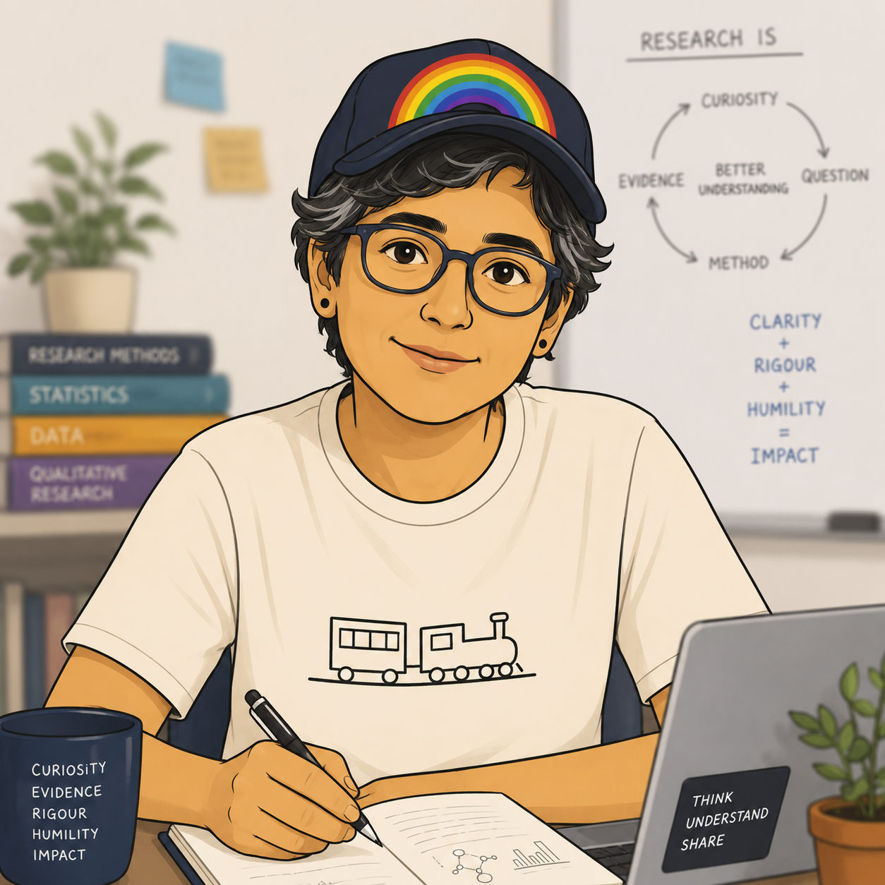{fig-align="center" fig-alt="Illustration of Arti, the focus learner persona."}
:::

::::

::: {.notes}
Learner personas in the Greg Wilson / Teaching Tech Together sense, synthesised from this cohort's survey (see learner-persona.md). Say the focus-learner idea out loud: I teach to Arti, which also serves Bianca (early finisher, curious about the command behind each click) and Cem (wants AI provenance; today is the foundation, agentic coding is the follow-up).
:::

## Course structure

-   [My turn]{.highlight-yellow}: Lecture segments + live coding
-   [Your turn]{.highlight-yellow}: Individual or 2-people team exercises (in break-out rooms on Zoom)

## Course icons

Two icons tell you [where]{.highlight-yellow} a step happens:

-    &nbsp; in the **RStudio IDE**, on your own machine
-    &nbsp; on **GitHub**, in the browser

Watch for these on every "Your turn" slide.

## Learning objectives

By the end of this workshop, you will be able to:

::: incremental
1.  [Create]{.highlight-yellow} and [clone]{.highlight-yellow} a repository, and [run]{.highlight-yellow} the full pull, stage, commit, push cycle from the RStudio IDE, including [reverting]{.highlight-yellow} a commit.

2.  [Create]{.highlight-yellow} a branch and [open]{.highlight-yellow} a pull request, [review]{.highlight-yellow} a colleague's pull request, and [merge]{.highlight-yellow} it after review.

3.  [Draw]{.highlight-yellow} a concept map of how Git and GitHub fit together.
:::

::: {.notes}
Bloom check: objective 1 is Apply (create, clone, run, revert are observable procedures you can check in the room); objective 2 is Apply plus Evaluate (reviewing a pull request is a judgement); objective 3 is Understand/Create (drawing the concept map externalises the mental model, and it is the measurement bookend for the day). Publish was removed as a core objective; publishing and a one-page personal website are offered as a follow-up on the website repository (profile links and bio), not dropped silently.
:::


## Schedule {.smaller .scrollable}

```{r}
#| tbl-colwidths: [25,75]
#| echo: false

read_csv(here::here("data/tbl-01-gitforsci-ghe-course-schedule.csv"),
         show_col_types = FALSE) |>
  filter(day == 1) |>
  select(Time = time, Module = title) |>
  kable()

```

# Concept maps

## Concept maps {.smaller}

A concept map is [things]{.highlight-yellow} (nodes) joined by [labelled arrows]{.highlight-yellow}, where every label is a verb.

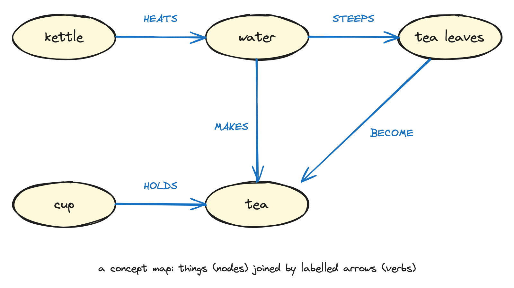{width="70%" fig-alt="A concept map about making tea. Five oval nodes labelled kettle, water, tea leaves, cup, and tea are joined by arrows labelled with capitalised verbs: HEATS, STEEPS, BECOME, MAKES, and HOLDS."}

::: {.notes}
Per Greg Wilson, Teaching Tech Together: concepts as nodes, labelled relationships as edges. Not a flowchart, not a timeline, not a list; no start, no end.

One sentence on why: experts use concept maps to make their mental models visible. Yours today will show how you currently think documents travel, and this evening the second map will show what changed.

8-10 minutes for this intro including the exemplar walk-through.
:::

## Your turn: your baseline map {.smaller}

:::: task
[How does a document you write reach your co-author and come back? Draw it as a concept map.]{.highlight-yellow}

-   Things as nodes, arrows with verb labels.
-   There is no wrong map; this one is yours.
-   Keep the map. You will need it again at the end of the day.

::: hand
 &nbsp; In the room: place the yellow sticky note on your laptop when your map is done.

 &nbsp; On Zoom: write "done" in the chat.
:::
::::

```{r}
#| echo: false
countdown(minutes = 8)
```

::: {.notes}
One single prompt, not a fused double question. Expected content: email attachments, Dropbox, Google Docs, file naming (final_v2, final_final). That is the point; the day connects Git to these habits. Do not correct anything here.

Bounded regroup: 2 minutes, then park-and-pair; 1:1 fix at the next break.
:::

# Create and clone {background-color="#0F4C81"}

## Arti's project {.smaller}

:::: columns

::: {.column width="50%"}
### Arti (before)

-   starts a new folder on her laptop
-   adds data as `.xlsx`
-   adds a `.docx` report
-   adds an R script
:::

::: {.column width="50%"}
### Arti (after)

-   [creates a repository on GitHub]{.highlight-yellow}
-   [clones it]{.highlight-yellow} and opens an RStudio project
-   adds data as `.csv`
-   adds a Quarto document and an R script
:::

::::

::: {.notes}
Same project, two ways. Read the columns as pairs: each line on the left has a Git/GitHub answer on the right. This is the whole block in one slide; the highlighted lines are what we do together next.
:::

## My turn {.smaller}

:::: columns

::: {.column width="50%"}
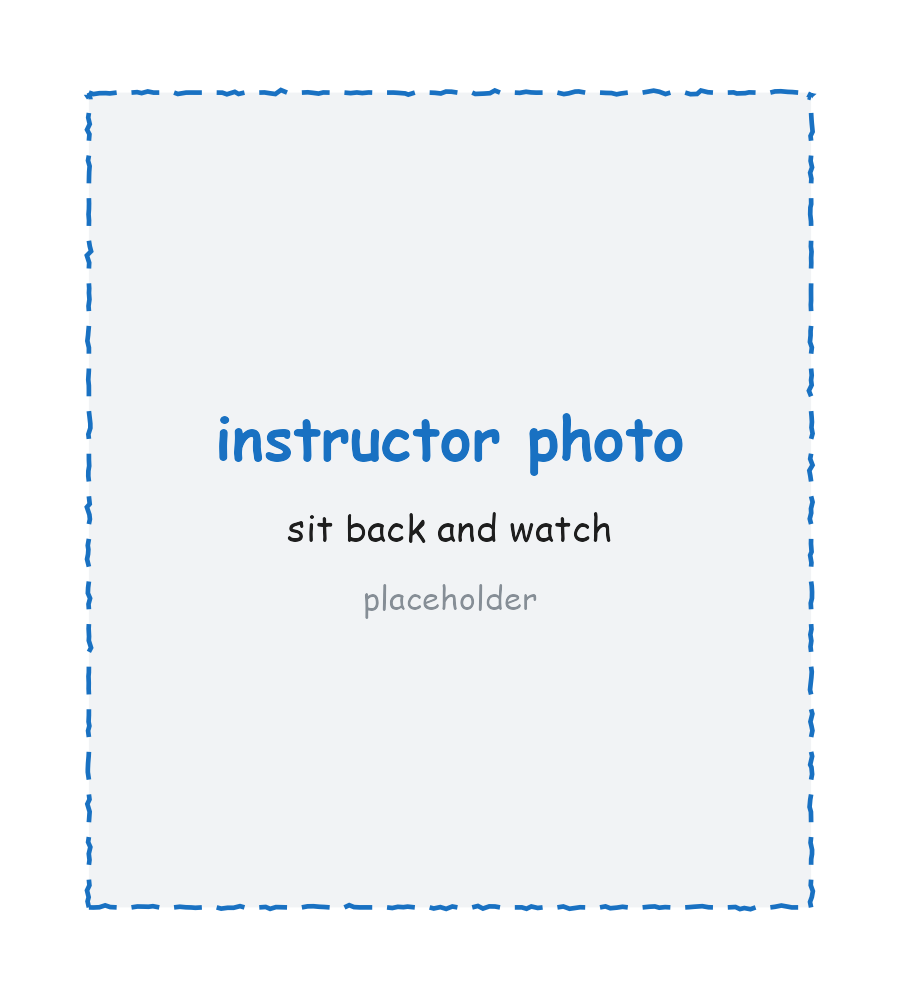{fig-align="center" width="90%" fig-alt="Photo of the instructor at the keyboard."}
:::

::: {.column width="50%"}
::: {.hand-purple style="margin-top: 1em;"}
Sit back and watch.

Note down any questions as they come up. We pick them up right after.
:::
:::

::::

::: {.notes}
Demo script:

- Create the repo on GitHub with a README so the clone is never empty.
- RStudio settings: Tools > Global Options > General: Save workspace to .RData on exit: Never. Tools > Global Options > Code: check use native pipe operator.
- Clone into the pre-work folder structure (~/Documents/gitrepos/gh-org-gitforsci-ghe is the example from the setup test; for their own repos, gh-USERNAME).
- The .Rproj and .gitignore explanation lives here, not on a slide: .Rproj holds RStudio project settings, .gitignore lists what Git should not track; the yellow ? icons mean Git sees the files but nobody has told it what to do with them yet. This answers the recorded learner question "why do .Rproj session files show up?". Mention that hidden files (starting with a dot) are hidden by the operating system.
:::

## Your turn {.smaller}

:::: task
 &nbsp; On **github.com**

1.  Create a repository called `website`, public, [with a README]{.highlight-yellow} (so the clone is never empty).

 &nbsp; In **RStudio**

2.  Set two options once (Tools \> Global Options): General \> never save `.RData` on exit; Code \> use the native pipe `|>`.
3.  Clone: File \> New Project \> Version Control \> Git, paste the HTTPS URL, create the project inside your `gitrepos` folder.
4.  Find `.gitignore` and `website.Rproj` in the Git tab with their yellow ? icons.

::: hand
 &nbsp; In the room: place the yellow sticky note on your laptop when you see the two yellow ? icons.

 &nbsp; On Zoom: write "done" in the chat.
:::
::::

```{r}
#| echo: false
countdown(minutes = 10)
```

::: {.notes}
Screenshots of the Code button, the New Project dialog, and the Git tab go here once available. `.Rproj` holds RStudio project settings; `.gitignore` lists what Git should not track; the yellow ? icons mean Git sees the files but has no instruction for them yet. Bounded regroup: 2 minutes, then park-and-pair; 1:1 fix at the next break.
:::

## Our turn {.smaller}

:::: task
Together, in your new `website` repository:

 &nbsp; On **github.com**

1.  Edit `README.md` and commit the change (the pencil icon, then "Commit changes").
2.  Add a file inside a new folder (Add file \> Create new file, type `data/notes.md`).

::: hand
 &nbsp; Place the yellow sticky note on your laptop when your commit shows in the repository.
:::
::::

```{r}
#| echo: false
countdown(minutes = 5)
```

## Local and remote {.smaller}

::: {.r-stack}
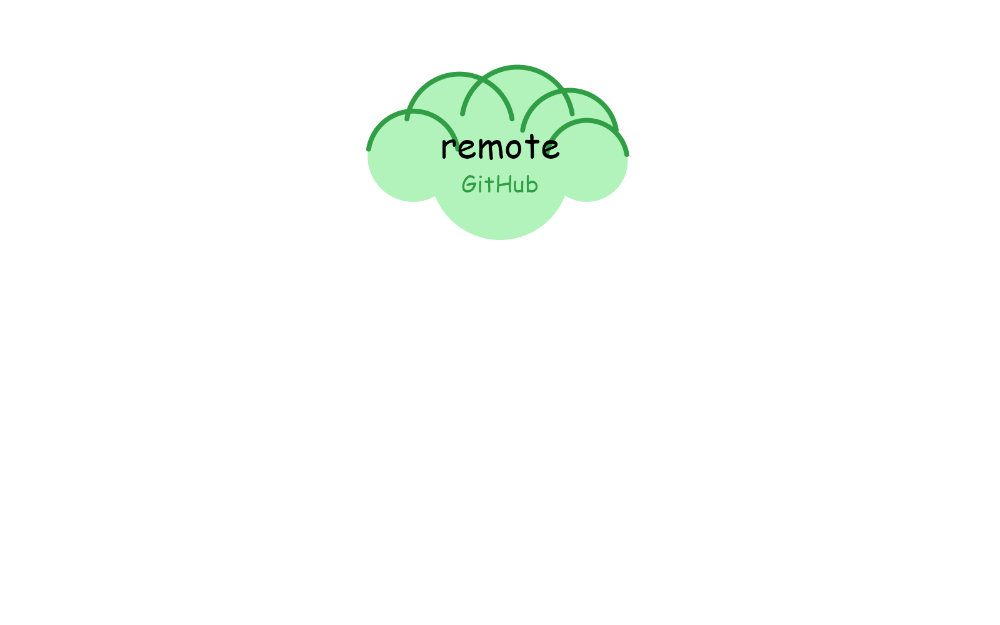{.fragment .fade-in width="70%" fig-align="center" fig-alt="A local repository on your laptop."}

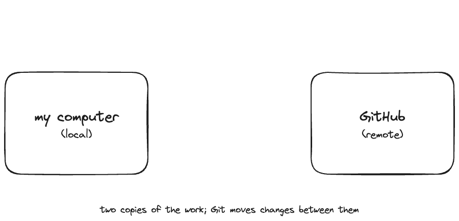{.fragment .fade-in width="70%" fig-align="center" fig-alt="A local repository and a remote repository on GitHub, side by side."}

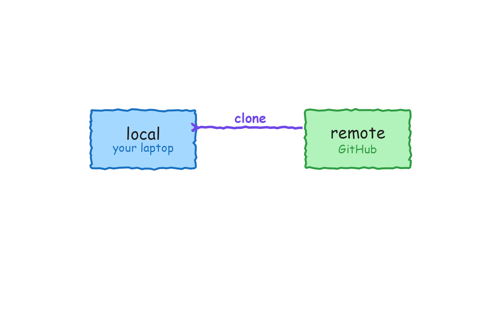{.fragment .fade-in width="70%" fig-align="center" fig-alt="A clone arrow copying the remote repository down to the local one."}

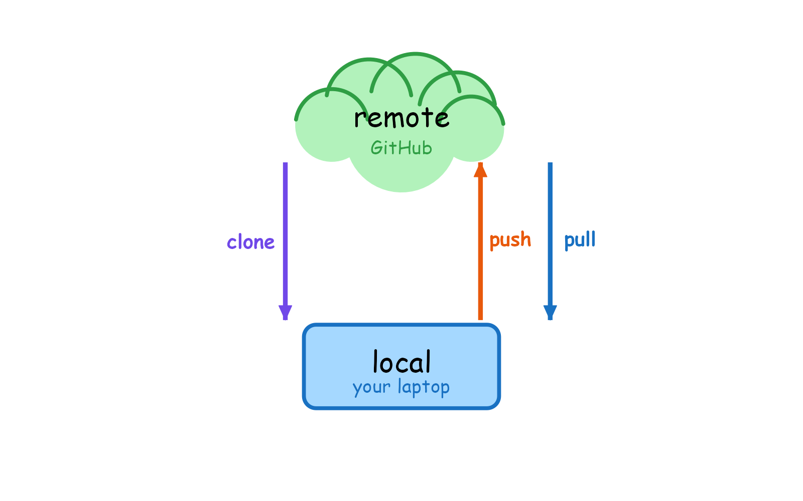{.fragment .fade-in width="70%" fig-align="center" fig-alt="Local and remote repositories connected by clone, push, and pull."}
:::

::: {.notes}
The summary of what we just did. Advance one element per press: local repository, then the remote on GitHub, then clone, then push and pull between them.
:::

## {.unlisted}

::: {.hand-purple style="text-align: center;"}
Anything from creating and cloning you'd like clarified before the break?
:::

```{r}
#| echo: false
countdown(minutes = 2)
```

## Take a break

[Please get up and move!]{.highlight-yellow}

{width="50%" fig-alt="Pixel art of a small character resting under a large leafy tree on a green hill, next to a gentle stream under a clear blue sky."}

```{r}
#| echo: false
countdown(minutes = 15)
```

::: footer
Image generated with [DALL-E 3 by OpenAI](https://openai.com/blog/dall-e/)
:::

# The commit cycle {background-color="#0F4C81"}

## A button is a command {.smaller}

-   RStudio is a [GUI]{.highlight-yellow}, a graphical user interface.
-   When you click **Pull** in the Git tab, RStudio runs `git pull` for you.
-   Every button we use today [is]{.highlight-yellow} a Git command underneath. Clicking it is not a lesser path.

::: {.notes}
This is the slide for Arti: the point-and-click interface is not cheating. The push button runs git push. Say it plainly and come back to it whenever someone worries they are "not really doing Git".
:::

## Arti's commit {.smaller}

:::: columns

::: {.column width="50%"}
### Arti (before)

-   opens a `.docx`
-   edits the text
-   the file autosaves
:::

::: {.column width="50%"}
### Arti (after)

-   opens a Quarto file
-   edits the text, it autosaves
-   after meaningful changes: [pull, stage, commit, push]{.highlight-yellow}
-   the commit message says what changed [and why]{.highlight-yellow}
:::

::::

## My turn {.smaller}

:::: columns

::: {.column width="50%"}
{fig-align="center" width="90%" fig-alt="Photo of the instructor at the keyboard."}
:::

::: {.column width="50%"}
::: {.hand-purple style="margin-top: 1em;"}
Sit back and watch.

Note down any questions as they come up. We pick them up right after.
:::
:::

::::

::: {.notes}
Demo script:

- Edit README, save, point out the blue M next to the file in the Git tab.
- Sync in 4 steps, said as a mantra: Pull (nothing to get, but build the habit), Stage (checkbox), Commit (message: "describe the repo content"), Push. Then open the repo on GitHub and show the commit message and the file change there.
- Revert demo, instructor only: make a deliberately bad commit (for example delete half the README), commit it, then revert it via the history; show that the history keeps both the mistake and the undo. Say the safety-net message out loud: almost everything in Git is reversible. This answers the recorded learner question "how do I take a commit back?".
- Credentials moment: hands up, who was asked for a username and password? Walk through gitcreds::gitcreds_set() in the console with the PAT from pre-work step 4. This is the moment credentials get fixed for everyone, before the afternoon depends on pushing.
:::

## Your turn {.smaller}

:::: task
The cycle, always in this order: [Pull, Stage, Commit, Push]{.highlight-yellow} (PSCP).

 &nbsp; In **RStudio**

1.  Edit your `README.md`: describe your website in one sentence. Save, and spot the blue M in the Git tab.
2.  Run the full cycle: [P]{.highlight-yellow}ull, [S]{.highlight-yellow}tage, [C]{.highlight-yellow}ommit (a message that says what changed), [P]{.highlight-yellow}ush.

 &nbsp; On **github.com**

3.  Open your repository and find your commit message and your change.

::: hand
 &nbsp; In the room: place the yellow sticky note on your laptop when you can see your commit on GitHub.

 &nbsp; On Zoom: write "done" in the chat.
:::
::::

```{r}
#| echo: false
countdown(minutes = 10)
```

::: {.notes}
Goal: every learner has at least 2 commits pushed to their own repo by the break. The revert stays instructor-only in this block; learners do not revert here. PSCP is the mantra; say it every time. Bounded regroup: 2 minutes, then park-and-pair; 1:1 fix at lunch.
:::

## The commit cycle {.smaller}

::: {.r-stack}
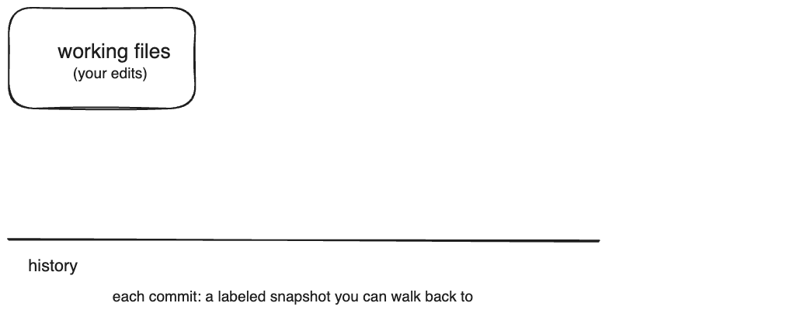{.fragment .fade-in width="70%" fig-align="center" fig-alt="Working files in your project."}

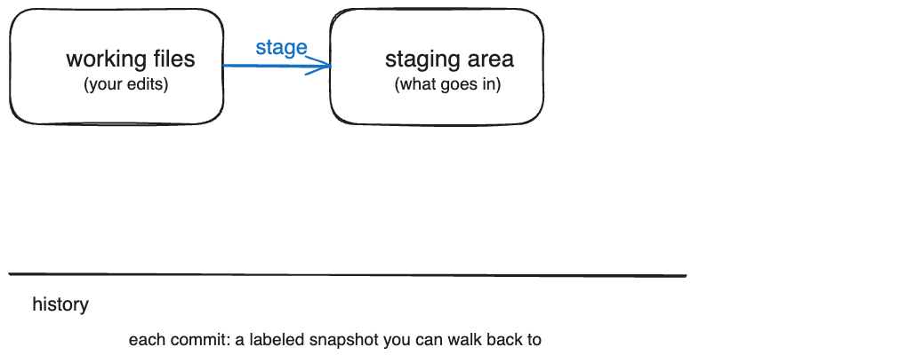{.fragment .fade-in width="70%" fig-align="center" fig-alt="Working files moved to the staging area."}

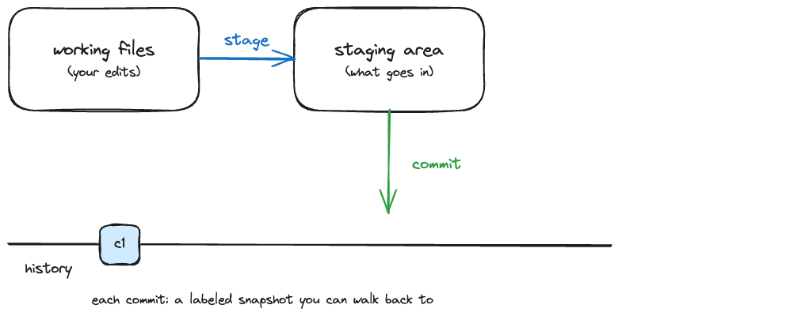{.fragment .fade-in width="70%" fig-align="center" fig-alt="A commit as a labelled snapshot on the history line."}

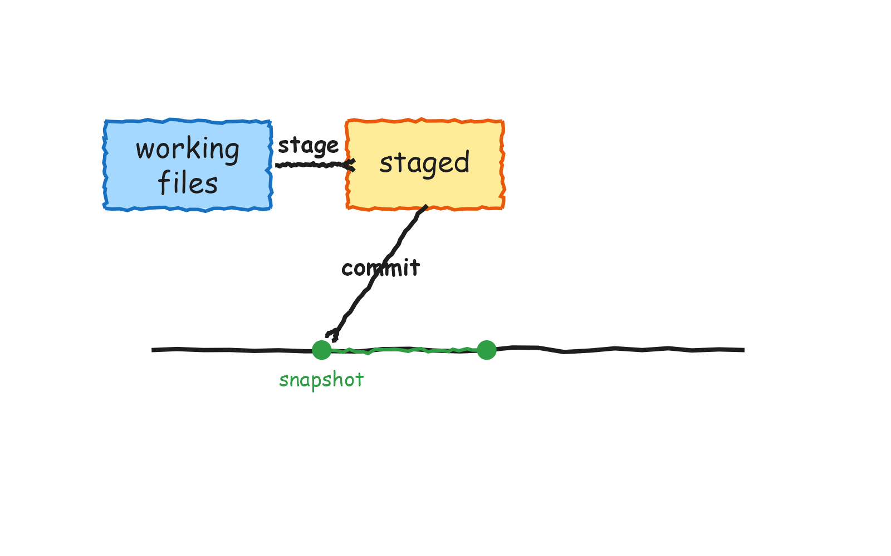{.fragment .fade-in width="70%" fig-align="center" fig-alt="A second commit growing the history line."}

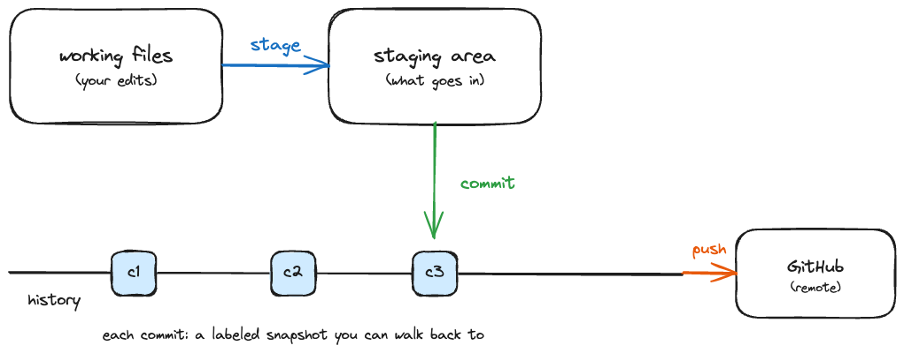{.fragment .fade-in width="70%" fig-align="center" fig-alt="The commits pushed from the local history line to the remote."}
:::

::: {.notes}
The summary of what we just did. Advance one element per press: working files, stage, commit as a labelled snapshot, the history line growing, then push.
:::

## {.unlisted}

::: {.hand-purple style="text-align: center;"}
Anything from the commit cycle you'd like clarified before we move on?
:::

```{r}
#| echo: false
countdown(minutes = 2)
```

# Team work {background-color="#0F4C81"}

## Arti joins a team {.smaller}

:::: columns

::: {.column width="50%"}
### Arti (before)

-   opens SharePoint
-   finds Cem's file
-   edits it in track changes
-   emails Cem to say it is done
:::

::: {.column width="50%"}
### Arti (after)

-   opens the project in RStudio
-   opens the Quarto file, edits
-   runs the [PSCP mantra]{.highlight-yellow}
-   and gets [blocked]{.highlight-yellow}
:::

::::

::: {.notes}
This slide sets up the cliffhanger. Arti does everything right and still cannot push to a teammate's repository. That is the safe-to-fail moment: nothing is broken, and the afternoon answers why.
:::

## Find your partner {.smaller}

::: task
-   You are in a pair with the partner you were told about before today.
-   Write [each other's GitHub username]{.highlight-yellow} on your sticky notes.
-   Keep that sticky note. Your partner returns after lunch.
:::

::: {.notes}
The sticky notes with usernames are the pairing record and carry into the pull-request block as reviewer assignments. If someone has no partner, they pair with the helper or the instructor.
:::

## Your turn {.smaller}

:::: task
 &nbsp; On **github.com**

1.  Browse to `github.com/USERNAME`, where USERNAME is [your partner's]{.highlight-yellow} username.

 &nbsp; In **RStudio**

2.  Clone their `website` repository (Code button, HTTPS URL, File \> New Project \> Version Control \> Git).
3.  Edit the README: add "This repo contains a personal website for USERNAME."
4.  Run the mantra: [Pull, Stage, Commit, Push]{.highlight-yellow}.

[What happens?]{.highlight-yellow}

::: hand
 &nbsp; In the room: place the yellow sticky note on your laptop when something unexpected happens.

 &nbsp; On Zoom: write "blocked" in the chat.
:::
::::

```{r}
#| echo: false
countdown(minutes = 10)
```

::: {.notes}
Everyone hits the push wall: 403, no write access. That is the plan; it is the safe-to-fail moment with the lowest stakes of the day. Nobody's work is harmed, nothing to clean up. Screenshot of the 403 error goes here once available. Bounded regroup: 2 minutes, then park-and-pair; 1:1 fix at lunch.
:::

## What just happened? {.smaller}

::: incremental
-   Your push [failed]{.highlight-yellow}: you can read their repository, but you have no write access.
-   Giving everyone write access ("collaborator") exists, but it does not scale, and it means anyone can change anything at any time.
-   So how do teams actually propose and review changes? [That is exactly what we solve after lunch: branches and pull requests.]{.highlight-yellow}
:::

::: {.notes}
The cliffhanger, stated explicitly. The morning ends with a question the afternoon answers. Do not resolve it now. The fork route (contributing to someone else's repo without write access) is the follow-up offer for building a personal website; mention it exists, do not teach it here.
:::

## Match the Git command to the button {.smaller}

::: task
A one-page handout: draw a line from each Git command to the button that runs it in RStudio or on GitHub.

-   [3 minutes]{.highlight-yellow} on your own.
-   [5 minutes]{.highlight-yellow} comparing with your partner.
-   The point: clicking a button runs the same command a terminal user types.
:::

::: {.notes}
Handout from gitforsci-dev/exercises (command-gui-matching). Print one learner sheet per person; remote participants receive it by email. Review as a group with the answer key afterwards. This is the "a button is a command" idea from B3, made concrete.
:::

## Lunch

::: {.hand-purple style="text-align: center;"}
The afternoon starts hands-on, and your partner is waiting for you.
:::

```{r}
#| echo: false
countdown(minutes = 45)
```

::: {.notes}
Return time is set on the day (timing to be finalised with a fresh schedule). The afternoon starts hands-on as the re-energizer; anyone who arrives late can join mid-exercise without missing slides.
:::

# Branch {background-color="#0F4C81"}

## Arti's branch {.smaller}

:::: columns

::: {.column width="50%"}
### Arti (before)

-   one shared file
-   everyone edits the same copy
-   changes collide
:::

::: {.column width="50%"}
### Arti (after)

-   [creates a branch]{.highlight-yellow} for her work
-   edits safely, away from `main`
-   her changes wait until the team is ready to bring them in
:::

::::

## My turn {.smaller}

:::: columns

::: {.column width="50%"}
{fig-align="center" width="90%" fig-alt="Photo of the instructor at the keyboard."}
:::

::: {.column width="50%"}
::: {.hand-purple style="margin-top: 1em;"}
Sit back and watch.

Note down any questions as they come up. We pick them up right after.
:::
:::

::::

::: {.notes}
Demo script:

- New repo, new move. Clone the team manuscript repo (same moves as this morning).
- Git pane: New Branch, name it dev. Read the message about origin out loud.
- Open index.qmd, edit the author details, Render.
- Switch between main and dev in the Git pane: before the commit nothing differs; after the commit, the change lives only on dev.
- Commit "update author details", push.

Packages are already installed from the pre-work setup test, so the render takes seconds. If a render fails on a missing package, the commented install chunk sits at the top of index.qmd; do not run installs for the room, park that learner and pair them. The branch created here feeds the pull request in the next block, so keep momentum.
:::

## Your turn {.smaller}

:::: task
Your team shares one manuscript repository, `washinvestments-<team>` (for example `washinvestments-red`).

 &nbsp; On **github.com**

1.  Find and clone [your team's]{.highlight-yellow} `washinvestments-<team>` repository (org page, search your team name).

 &nbsp; In **RStudio** (one person drives)

2.  Git pane: New Branch, name it `dev`.
3.  In `index.qmd`: put in [your own]{.highlight-yellow} author details in one of the two author slots. Render.
4.  Run the mantra: [Pull, Stage, Commit, Push]{.highlight-yellow} with the message "update author details".

::: hand
 &nbsp; In the room: place the yellow sticky note on your laptop when your push has finished.

 &nbsp; On Zoom: write "done" in the chat.
:::
::::

```{r}
#| echo: false
countdown(minutes = 10)
```

::: {.notes}
Team repos are `washinvestments-<team>`, created from the reworked manuscript template (two author slots, no publishing). Team names are set on the day; use the placeholder until then. Screenshots of the New Branch, Render, and Git-tab buttons go here once available. One person drives so the branch and commit are shared; the partner reviews in the next block.
:::

## Branching {.smaller}

::: {.r-stack}
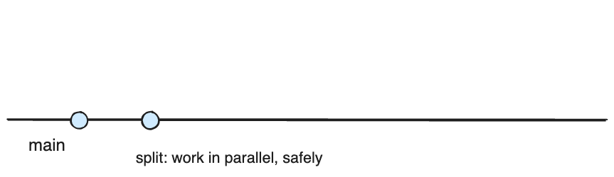{.fragment .fade-in width="70%" fig-align="center" fig-alt="The main line with a couple of commits."}

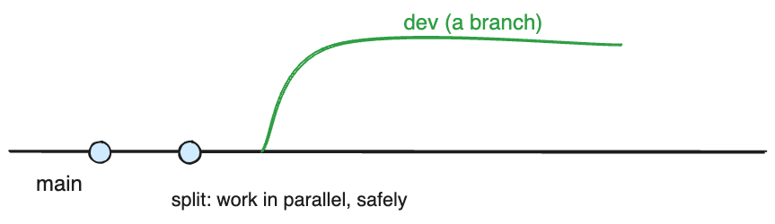{.fragment .fade-in width="70%" fig-align="center" fig-alt="A dev branch splitting off from main."}

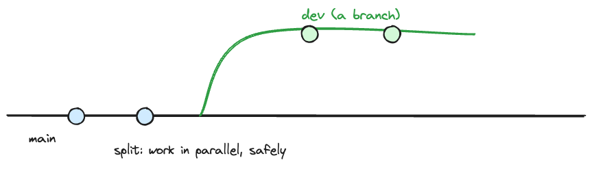{.fragment .fade-in width="70%" fig-align="center" fig-alt="Commits landing on the dev branch."}

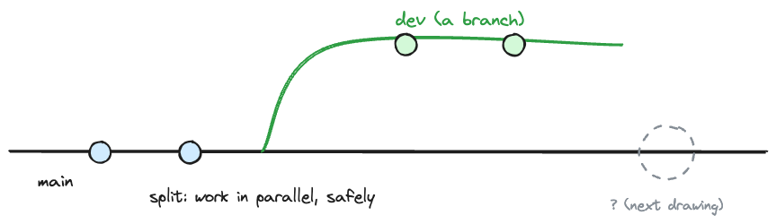{.fragment .fade-in width="70%" fig-align="center" fig-alt="The branch and main lines with the merge point left empty for now."}
:::

::: {.notes}
The summary of what we just did. Advance one element per press: the main line, the dev branch splitting off, commits landing on the branch, and the merge point left empty until the pull request in the next block.
:::

# Pull request, review, merge {background-color="#0F4C81"}

## Arti's review {.smaller}

:::: columns

::: {.column width="50%"}
### Arti (before)

-   emails the file back and forth
-   comments live in track changes
-   no record of who changed what, when
:::

::: {.column width="50%"}
### Arti (after)

-   opens a [pull request]{.highlight-yellow}
-   her partner leaves [line comments]{.highlight-yellow}
-   the change is [merged]{.highlight-yellow} after review, with a full record
:::

::::

::: {.notes}
Same review habit Arti already has (comments in tracked changes), now on GitHub with a record. This is the moment the day was built for.
:::

## My turn {.smaller}

:::: columns

::: {.column width="50%"}
{fig-align="center" width="90%" fig-alt="Photo of the instructor at the keyboard."}
:::

::: {.column width="50%"}
::: {.hand-purple style="margin-top: 1em;"}
Sit back and watch.

Note down any questions as they come up. We pick them up right after.
:::
:::

::::

::: {.notes}
Demo script:

- On GitHub: switch to dev, click Compare & pull request. Title: "Add author details to manuscript".
- Request a reviewer. Walk the tabs: Commits, Files changed.
- As the reviewer: start a review, leave line comments, submit. Review comment examples to reuse verbatim: "That's not a good title for a manuscript. Please suggest 2 alternatives." and "This list is not complete."
- Open an issue with a task list next to the PR. Merge, confirm, tick off the task.
- Back in RStudio: switch to main, read the "behind origin/main, can be fast-forwarded" message out loud, Pull. Then the gotcha: switch back to dev. Name it as a habit: merged? Then pull main, and go back to your working branch.
:::

## Your turn {.smaller}

:::: task
 &nbsp; On **github.com**

1.  Open a pull request from your `dev` branch. Title it so your reviewer knows what changed.
2.  Request a review [from your partner]{.highlight-yellow} (the username on your sticky note).
3.  Review [your partner's]{.highlight-yellow} pull request: at least [one line comment]{.highlight-yellow}, then submit the review.
4.  After your review arrives: [merge the PR]{.highlight-yellow}, confirm.

 &nbsp; In **RStudio**

5.  Switch to `main`, [Pull]{.highlight-yellow}, and [switch back to `dev`]{.highlight-yellow}.

[Partner not ready? Review the seed PR in your team repository instead. Nobody waits on anybody.]{.highlight-yellow}

::: hand
 &nbsp; In the room: place the yellow sticky note on your laptop after the switch back to dev.

 &nbsp; On Zoom: write "done" in the chat.
:::
::::

```{r}
#| echo: false
countdown(minutes = 15)
```

::: {.notes}
Default path: partner-pair review with the sticky-note pairs. Fallback path, on the slide itself: every team repo has a pre-opened seed PR ("Seed: suggestions to review"), so the exercise never blocks on a partner's progress.

Target: every learner opens a PR, writes at least one line comment, merges, and pulls. This block is protected: if the day is behind, cut elsewhere, never this. Bounded regroup: 2 minutes, then park-and-pair.
:::

## The pull request {.smaller}

::: {.r-stack}
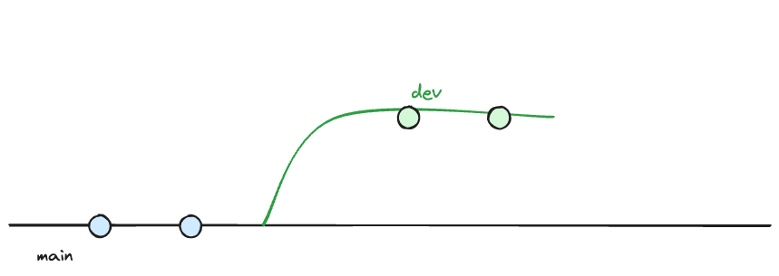{.fragment .fade-in width="70%" fig-align="center" fig-alt="The dev branch and main line with an open merge point."}

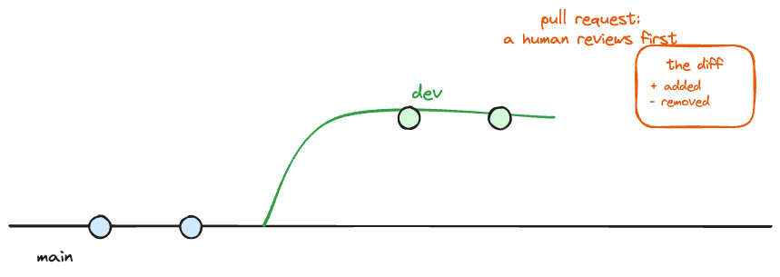{.fragment .fade-in width="70%" fig-align="center" fig-alt="A pull request opened at the join between the branch and main."}

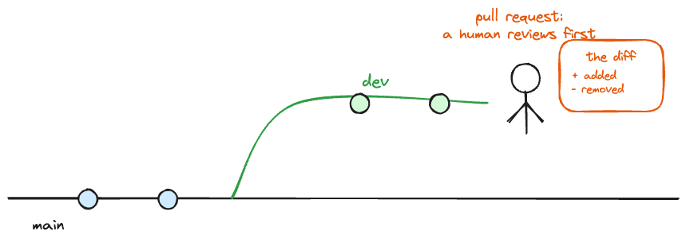{.fragment .fade-in width="70%" fig-align="center" fig-alt="A human review pausing at the join before the lines meet."}

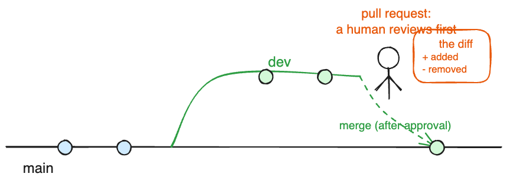{.fragment .fade-in width="70%" fig-align="center" fig-alt="The branch merged into main, the lines meeting."}
:::

::: {.notes}
The summary of what we just did. Advance one element per press: the open merge point from the branching drawing, the pull request, the human review at the join, then the merge.
:::

# Concept map revisit and wrap-up {background-color="#0F4C81"}

## Your turn: your map, revisited {.smaller}

:::: task
[Draw a concept map of Git and GitHub as you understand them now.]{.highlight-yellow}

-   Use the words from today: repository, clone, commit, push, pull, branch, pull request, merge, review.
-   Then put it [next to your morning map]{.highlight-yellow} and share both with your partner.

::: hand
With your consent, I would like to photograph both maps (anonymously) to improve this workshop.
:::
::::

```{r}
#| echo: false
countdown(minutes = 8)
```

::: {.notes}
This block is protected and runs even on the worst day.

The comparison is the measurement instrument for the whole redesign. Consent is asked on the slide; photograph only the maps of learners who agree, no names on the photos.

Fallback if the morning baseline went badly: draw the Git concept map yourself on the board as the closing recap and have the room call out the verb for each arrow (see the handbook, concept maps as bookends).
:::

## The day in one line

[create]{.highlight-yellow} , [clone]{.highlight-yellow} , [commit]{.highlight-yellow} , [push]{.highlight-yellow} , [pull]{.highlight-yellow} , [branch]{.highlight-yellow} , [pull request]{.highlight-yellow} , [review]{.highlight-yellow} , [merge]{.highlight-yellow}

::: {.notes}
Recap as verbs, spoken while pointing at the drawings on the board. What you also picked up on the side: RStudio fluency, a first taste of Quarto, and reversibility as a habit.
:::

## What you also learned today

-   RStudio, now with muscle memory
-   Quarto: one document you can render
-   Reversibility as a habit: commit early, revert without fear

## What comes next {.smaller}

::: incremental
-   [Working with AI coding agents]{.highlight-yellow} is the follow-up workshop, and it builds on exactly what you did today: branches, pull requests, review.
-   Want a [personal website]{.highlight-yellow}? I offer a follow-up to build a one-page site with your profile links and bio.
-   Interested in either? Email me and you will hear from me when dates are set.
-   Start your first own project with Git and GitHub this week (already have a project? [Read here](https://happygitwithr.com/existing-github-first#existing-github-first)).
-   Keep learning by doing: open pull requests to yourself, review your own diffs.
:::

## Feedback, and thanks!

-   Please fill in the post-course survey (link shared by email, 5 minutes, anonymous).
-   Email me your open questions; I answer all of them this week.

All material is licensed under [Creative Commons Attribution Share Alike 4.0 International](https://creativecommons.org/licenses/by-sa/4.0/).

::: {.notes}
Survey link goes out by email right now, while the slide is up, so phones can grab it. End on momentum: recap done, next step named, thanks.
:::

## Thanks!

Slides created via revealjs and Quarto: <https://quarto.org/docs/presentations/revealjs/>

Access slides as [PDF on GitHub](https://github.com/gitforsci-ghe/website/raw/main/workshop/slides.pdf)

All material is licensed under [Creative Commons Attribution Share Alike 4.0 International](https://creativecommons.org/licenses/by-sa/4.0/).

## References
